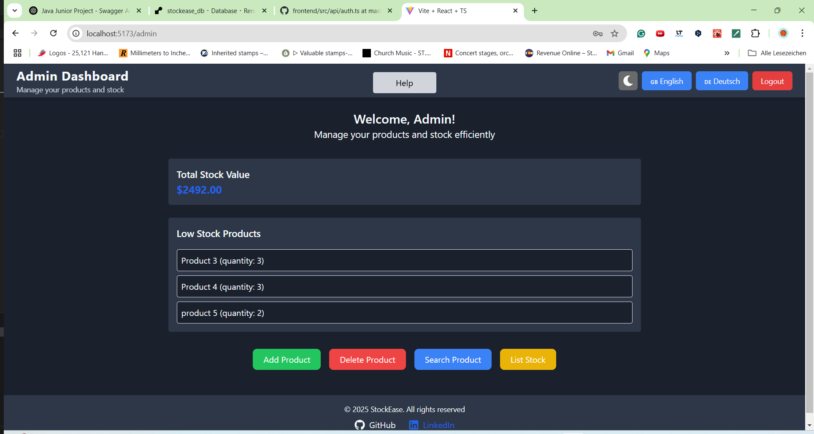

# StockEase Frontend

## About
StockEase is a React + TypeScript application for efficient stock and inventory management. It integrates with the StockEase backend to provide authentication, role-based access control, and complete CRUD operations for products.

## Description

This project represents the frontend interface of the StockEase ecosystem — a production-ready web client that provides an intuitive, responsive, and secure user experience. It implements JWT-based authentication, role-based access, dark mode, and multilingual support.

The system is fully integrated with the StockEase Backend (Spring Boot + PostgreSQL), includes CI/CD automation via GitHub Actions and Vercel deployment, and follows modern frontend engineering principles such as component modularity, code linting, and responsive UI using Tailwind CSS and ShadCN UI.

📅 Last Updated: November 5, 2025 – Documentation and CI/CD updates

## 📖 Table of Contents

1. [Screenshots](#screenshots)  

2. [Project Status](#project-status)  

3. [Features](#features)  

4. [Security](#security)  

5. [Documentation](#documentation)

  - [Architecture Overview](#architecture-overview)

6. [Testing & Code Quality](#testing-code-qquality)

7. [Tech Stach](#tech-stack)

8. [CI/CD](#cicd)

9. [Available Scripts](#available-scripts)

10. [Deployment](#deployment)

11. [Contributing](#contributing)

---

<a id="screenshots"></a>

## 🖼️ Screenshots
Here are some screenshots showcasing StockEase UI:

  **Admin Dashboard:**
  
  
  
- **German Version:**
- 
  
  
- **Dark Mode Enabled:**
- 
  

---

<a id="project-status"></a>

## 🧭 Project Status 

### ✅ Frontend Development – Stable

- ✅ Integrated with StockEase Backend

- ✅ CI/CD pipeline working and deployed on Vercel

- ✅ JWT authentication and multi-language support operational

- 🚧 Frontend tests and coverage reports under construction

### 📚 Documentation Status

- 🚧 Architecture documentation – Under development

- 🚧 Testing documentation – Under construction

---

<a id="features"></a>

## 🚀 Features

✅ User Authentication with JWT 🔑  
✅ Role-Based Access Control (Admin & User) 👥  
✅ CRUD Operations for Products 📝 
✅ Paginated Product Fetching 📑  
✅ Total Stock Value Calculation 💰  
✅ Dark Mode Support 🌙  
✅ Multi-Language Support (English & German) 🌍 
✅ Fully Responsive Design 📱  

---

<a id="security"></a>

## 🛡️Security

StockEase Frontend enforces secure communication with the backend using JWT authentication. Tokens are securely handled in memory and transmitted via HTTPS only.

Role-based access ensures that users (Admin/User) interact only with authorized components. Protected routes, input validation, and conditional rendering safeguard user sessions.

  📖 View Security Architecture Documentation (under construction)

---

<a id="documentation"></a>

## 📘 Documentation

<a id="architecture-overview"></a>

### 🏗️ Architecture Overview

Architecture Documentation: 🚧 Under Construction

Planned topics include component structure, routing flow, state management, and integration layers.

Future updates will include diagrams showing data flow between the frontend and backend APIs.

- **Backend Architecture & API Docs:** [View Backend Docs](https://keglev.github.io/stockease/)

<a id="testing-code-quality"></a>

## 🧪 Testing & Code Quality

Frontend testing and coverage reporting are currently under construction.

Planned stack includes:

- Vitest / Jest for unit testing

- React Testing Library for UI behavior tests

- ESLint + Prettier for code consistency

- Vite coverage plugin for reporting

---

<a id="tech-stack"></a>

## ⚙️ Techn Stack 
- **React** 
- **TypeScript** 
- **React Router** 
- **Tailwind CSS** 
- **Vite** 
- **Axios** 
- **i18next** 
- **JWT Authentication** 
- React Hook Form
- React Query 
- **ShadCN UI**

---

<a id="cicd"></a>

## ⚙️ CI/CD

The StockEase Frontend uses GitHub Actions for continuous integration and Vercel for automated deployment.

### 🔄 Automated Pipeline

Workflow Overview:

- ✅ Node.js 20 runtime

- ✅ Cache npm dependencies for faster builds

- ✅ Install dependencies via npm ci

- ✅ Run ESLint for code quality checks

- ✅ Build production bundle with Vite

- ✅ Build Docker image (for container verification)

- ✅ Deploy automatically to Vercel

  📖 CI/CD Documentation link will be added once architecture docs are published.

---

## 🧑‍💻 Available Scripts
```sh
npm run dev         # Starts the development server
npm run build       # Builds the project for production
npm run preview     # Previews the production build
npm run lint        # Runs ESLint for code linting
``` 
---

<a id="deployment"></a>

## 🚢 Deployment
Production Deployment

The StockEase Frontend is hosted on Vercel, ensuring global availability, fast delivery, and seamless CI/CD integration.

Deployment Highlights:

- ✅ Automated Workflow: Push to main → auto-lint, build, and deploy

- ✅ Optimized Builds via Vite

- ✅ Instant Rollbacks via Vercel dashboard

- ✅ Connected Backend for real-time product management

### Live Application:

🌐**Production URL**: [StockEase Frontend](https://stockeasefrontend.vercel.app/)

---

<a id="contributing"></a>

## 🤝 Contributing
Contributions are welcome! If you'd like to improve this project, feel free to:

1. Fork the repository
2. Create a new branch
3. Make your changes
4. Submit a pull request

For any issues or improvements, please open a GitHub issue. 🚀


