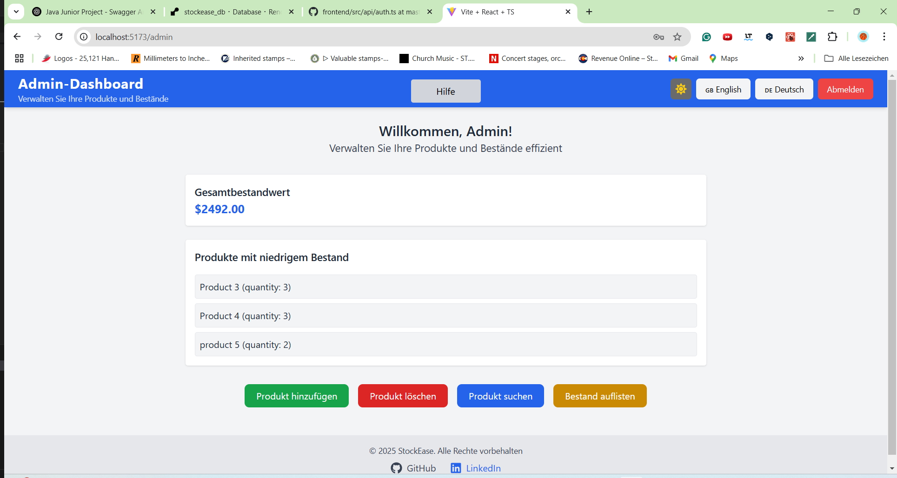

# StockEase Frontend

## About
StockEase is a frontend application built with React and TypeScript to provide an intuitive user interface for managing stock-related data. It integrates seamlessly with the **StockEase Backend**, offering authentication, role-based access control, and CRUD operations for products. This project is part of a portfolio to demonstrate frontend development skills with React and API integration.

## 📖 Table of Contents
- 📌 About
- 🚀 Features
- 🖼️ Screenshots
- 🛠️ Installation
- 📌 Usage
- 🧑‍💻 Available Scripts
- ⚙️ Technologies
- 🔗 API Integration
- 🤝 Contributing

## 🚀 Features
✅ User Authentication with JWT 🔑  
✅ Role-Based Access Control (Admin & User) 👥  
✅ CRUD Operations for Products 📝 
✅ Paginated Product Fetching 📑  
✅ Total Stock Value Calculation 💰  
✅ Dark Mode Support 🌙  
✅ Multi-Language Support (English & German) 🌍 
✅ Fully Responsive Design 📱  

## 🖼️ Screenshots
Here are some screenshots showcasing StockEase UI:

  **Admin Dashboard:**
  
  
  
- **German Version:**
- 
  
  
- **Dark Mode Enabled:**
- 
  

## 🛠️ Installation
### 1. Clone the Repository
```sh
git clone https://github.com/yourusername/StockEase-Frontend.git
cd StockEase-Frontend
```

### 2. Install Dependencies
```sh
npm install
```

### 3. Configure Environment Variables
Create a **.env** file in the project root and set up the API base URL:
```
VITE_API_BASE_URL=http://localhost:8081/api
```
Adjust the URL if deploying to a different backend.

### 4. Run the Application
```sh
npm run dev
```
This will start the development server at **http://localhost:5173** (default Vite port).

## 📌 Usage
This frontend allows users to:
- Log in with JWT authentication
- View and manage stock-related data
- Admin users can add, edit, and delete products
- Regular users can search, modify and view product details
- Supports pagination and real-time stock value calculation

## 🧑‍💻 Available Scripts
```sh
npm run dev         # Starts the development server
npm run build       # Builds the project for production
npm run preview     # Previews the production build
npm run lint        # Runs ESLint for code linting
```

## Technologies ⚙️
- *React 
- *TypeScript 
- React Router 
- *Tailwind CSS 
- *Vite 
- *Axios 
- *i18next 
- *JWT Authentication 
- React Hook Form
- React Query 
- ShadCN UI 

## 🔗 API Integration
This frontend communicates with the **StockEase Backend**, which provides RESTful API endpoints for managing stock data.

📌 View Full API Documentation: [StockEase Backend API Docs](#) (Update with actual link)

## 🤝 Contributing
Contributions are welcome! If you'd like to improve this project, feel free to:

1. Fork the repository
2. Create a new branch
3. Make your changes
4. Submit a pull request

For any issues or improvements, please open a GitHub issue. 🚀


