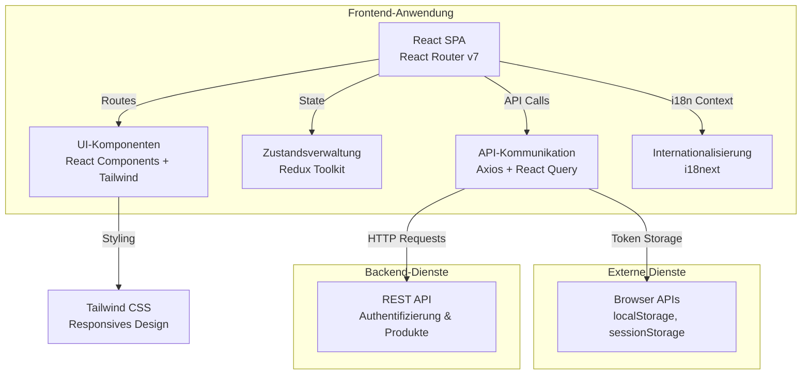
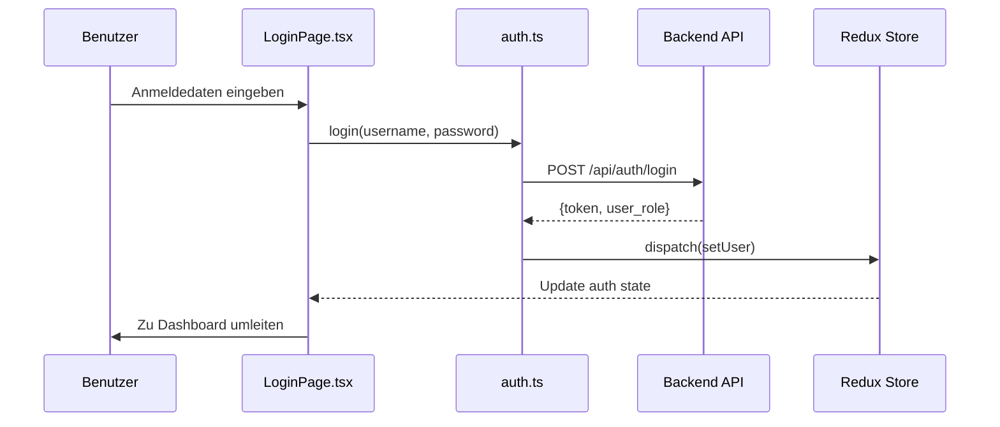
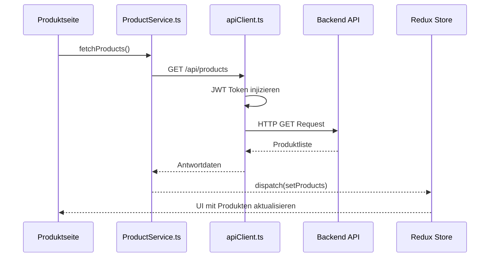

# StockEase Frontend - Architektur-Übersicht

## Projektübersicht

**StockEase Frontend** ist eine moderne, responsive Webanwendung, die mit **React 18** und **TypeScript** gebaut wurde und Bestandsverwaltungsfunktionalität bereitstellt. Die Anwendung unterstützt mehrere Sprachen (Englisch und Deutsch), responsive Designs und umfassende Testabdeckung.

### Hauptziele

- **Mehrsprachige Unterstützung**: Unterstützen Sie Englisch und Deutsch durch Internationalisierung (i18n)
- **Responsives Design**: Bieten Sie nahtlose Erfahrung auf Desktop- und Mobilgeräten
- **Typsicherheit**: Vollständige TypeScript-Implementierung für Wartbarkeit und Entwicklererfahrung
- **Umfassende Tests**: 478+ Unit- und Integrationstests zur Sicherung der Codequalität
- **Enterprise-Standards**: Enterprise-grade Dokumentation, Fehlerbehandlung und Architekturmuster

---

## Anwendungsarchitektur

### Architektur-Diagramm auf hoher Ebene



---

## Kerntechnologien

| Technologie | Version | Zweck |
|------------|---------|---------|
| **React** | 18.3.1 | UI-Bibliothek und Component-Framework |
| **TypeScript** | ~5.6.2 | Typsichere Entwicklung |
| **Vite** | 6.0.5 | Build-Tool und Development Server |
| **React Router** | 7.1.1 | Client-seitiges Routing |
| **Redux Toolkit** | 2.5.0 | Zustandsverwaltung |
| **Axios** | 1.7.9 | HTTP-Client |
| **React Query** | 5.62.16 | Server-Zustandsverwaltung |
| **i18next** | 24.2.2 | Internationalisierungs-Framework |
| **Tailwind CSS** | 3.4.17 | Utility-First CSS Framework |
| **Vitest** | 4.0.8 | Unit-Test-Framework |

---

## Projektstruktur

```
frontend/
├── src/
│   ├── App.tsx                          # Root-Komponente mit Routing
│   ├── main.tsx                         # Anwendungseinstiegspunkt
│   ├── i18n.ts                          # i18next-Konfiguration
│   ├── api/                             # API-Service-Layer
│   │   ├── auth.ts                      # Authentifizierungs-Endpoints
│   │   └── ProductService.ts            # Produkt CRUD-Operationen
│   ├── components/                      # Wiederverwendbare UI-Komponenten
│   │   ├── Header.tsx
│   │   ├── Sidebar.tsx
│   │   ├── Footer.tsx
│   │   ├── Buttons.tsx
│   │   ├── ErrorBoundary.tsx
│   │   ├── HelpModal.tsx
│   │   └── SkeletonLoader.tsx
│   ├── pages/                           # Seiten-Level-Komponenten (geroutet)
│   │   ├── HomePage.tsx
│   │   ├── LoginPage.tsx
│   │   ├── AdminDashboard.tsx
│   │   ├── UserDashboard.tsx
│   │   ├── AddProductPage.tsx
│   │   ├── DeleteProductPage.tsx
│   │   ├── SearchProductPage.tsx
│   │   ├── ListStockPage.tsx
│   │   └── ChangeProductDetailsPage.tsx
│   ├── services/                        # Geschäftslogik & Integrationen
│   │   └── apiClient.ts                 # Konfigurierte Axios-Instanz
│   ├── types/                           # TypeScript Schnittstellen & Typen
│   │   └── Product.ts
│   ├── logic/                           # Geschäftslogik-Hooks
│   │   └── DashboardLogic.ts
│   ├── styles/                          # Globale und Komponenten-Stile
│   ├── assets/                          # Bilder und statische Assets
│   ├── locales/                         # i18n-Übersetzungsdateien
│   │   ├── en.json
│   │   ├── de.json
│   │   ├── help_en.json
│   │   └── help_de.json
│   └── __tests__/                       # Test-Dateien (spiegelt src-Struktur)
│       ├── component/
│       ├── api/
│       ├── auth/
│       ├── a11y/
│       ├── workflows/
│       ├── product-operations/
│       ├── validation-rules/
│       ├── i18n-configuration/
│       ├── api-client-operations/
│       ├── setup.ts
│       └── ... (49+ Test-Dateien)
├── docs/
│   └── architecture/                    # Architektur-Dokumentation
│       ├── overview.md
│       ├── src/
│       ├── pipeline.md
│       └── ...
├── Dockerfile                           # Multi-Stage Docker Build
├── vite.config.ts                       # Vite-Konfiguration
├── vitest.config.ts                     # Vitest-Konfiguration
├── tsconfig.json                        # TypeScript Root-Konfiguration
├── tailwind.config.js                   # Tailwind CSS-Konfiguration
├── package.json                         # Projekt-Abhängigkeiten
└── .github/
    └── workflows/
        ├── deploy-frontend.yml          # Test & Deploy Pipeline
        └── deploy-docs.yml              # Dokumentation Deployment (TBD)
```

---

## Architektur-Schichten

### 1. **Präsentationsschicht** (`/components`, `/pages`, `/styles`)

- **Verantwortung**: UI rendern und Benutzerinteraktionen verarbeiten
- **Technologien**: React-Komponenten, Tailwind CSS
- **Muster**: Komponenten-basierte Architektur mit Separation of Concerns
- **Schlüsselkomponenten**: Header, Sidebar, Footer, Modal, Formulare

### 2. **Routing-Schicht** (`App.tsx`, `pages/`)

- **Framework**: React Router v7
- **Muster**: Deklarative Route-Definitionen
- **Routes**:
  - `/` → HomePage
  - `/login` → LoginPage
  - `/admin` → AdminDashboard (nur Admin)
  - `/user` → UserDashboard (nur Benutzer)
  - `/product/*` → Produktverwaltungsseiten

### 3. **Zustandsverwaltung** (Redux Toolkit)

- **Zweck**: Zentralisierter State für Authentifizierung, Benutzerdaten und Anwendungsstatus
- **Muster**: Slice-basierte Reducer (Redux Toolkit)
- **Umfang**: Globaler State für komponentenübergreifende Kommunikation

### 4. **API-Kommunikationsschicht** (`/api`, `/services`)

- **HTTP-Client**: Axios mit benutzerdefinierter Konfiguration
- **Features**:
  - JWT Token-Injektion in Request-Header
  - Automatische 401-Fehlerbehandlung
  - Request/Response-Logging
  - Zentralisierte Fehlerbehandlung
- **Services**:
  - `auth.ts` → Authentifizierungs-Endpoints
  - `ProductService.ts` → Produkt CRUD-Operationen

### 5. **Geschäftslogik-Schicht** (`/logic`, `/services`)

- **Zweck**: Geschäftslogik, Datentransformationen und Utility-Funktionen
- **Beispiele**: Dashboard-Berechnungen, Produktfilterung, Validierungsregeln
- **Muster**: Custom Hooks und Utility-Funktionen

### 6. **Datenschicht** (`/types`)

- **Zweck**: TypeScript-Schnittstellen und Datenverträge
- **Gewährleistet**: Typsicherheit über die gesamte Anwendung

### 7. **Internationalisierungsschicht** (`/locales`, `i18n.ts`)

- **Framework**: i18next mit React-Integration
- **Sprachen**: Englisch (en), Deutsch (de)
- **Features**: Browser-Spracherkennung, localStorage-Persistenz
- **Namespaces**: `translation` (allgemein), `help` (Hilfe-Modal)

---

## Datenfluss

### Authentifizierungsfluss



### Produktdatenfluss



---

## Wichtige Architektur-Entscheidungen

### 1. **React Router v7 für Routing**
- Bietet deklaratives Route-Management
- Unterstützt verschachtelte Routes und dynamische Segmente
- Eingebautes Datenladen und Fehlerbehandlung

### 2. **Redux Toolkit für Zustandsverwaltung**
- Zentralisierter State für Authentifizierung und App-weite Daten
- Vereinfachte Reducer-Syntax mit Immer-Integration
- DevTools-Unterstützung zum Debuggen

### 3. **Axios + React Query**
- Axios bietet Low-Level HTTP-Kontrolle
- React Query verwaltet Caching und Synchronisation
- Separation of Concerns (HTTP vs Datensynchronisation)

### 4. **i18next für Internationalisierung**
- Flexible Sprachladeung und -wechsel
- Namespace-Unterstützung für organisierte Übersetzungen
- Automatische Browser-Spracherkennung

### 5. **Tailwind CSS für Styling**
- Utility-First-Ansatz reduziert benutzerdefiniertes CSS
- Responsives Design mit Mobile-First-Breakpoints
- Dark Mode und Theme-Anpassungsunterstützung

### 6. **TypeScript für Typsicherheit**
- Fehler zur Compile-Zeit erkennen
- Bessere IDE-Unterstützung und Refactoring-Tools
- Selbstdokumentierender Code

### 7. **Vitest für Tests**
- Schnelle Unit-Tests mit Jest-kompatibler API
- Eingebaute Coverage-Berichterstattung
- 478+ Tests sichern Codequalität

---

## Sicherheitserwägungen

### Authentifizierung & Autorisierung

```
1. JWT Token-Verwaltung
   ├── Gespeichert in localStorage (HttpOnly Cookies bevorzugt)
   ├── Automatisch in Authorization Header injiziert
   ├── Bei Login erneuert
   └── Gelöscht bei Logout oder 401-Antwort

2. Geschützte Routes
   ├── Admin Routes (/admin, /add-product)
   ├── Benutzer Routes (/user)
   └── Öffentliche Routes (/, /login)

3. Token-Validierung
   ├── Serverseitige Signatur-Verifikation
   ├── Clientseitige Rolle-Extraktion
   └── Automatische Bereinigung bei Ablauf
```

### API-Sicherheit

- **CORS**: Von Backend verwaltet
- **HTTPS**: In Produktion erzwungen
- **Timeout**: 2-Minuten-Request-Timeout
- **Fehlerbehandlung**: Sensible Daten nicht geloggt

---

## Entwicklungs-Workflow

### Lokale Entwicklung

```bash
# Development Server starten (Vite HMR)
npm run dev

# Tests im Watch-Modus ausführen
npm run test:watch

# Spezifische Test-Suite ausführen
npm test -- --run

# Coverage-Bericht generieren
npm run test:coverage

# Für Produktion bauen
npm run build

# Produktions-Build anzeigen
npm run preview
```

### Test-Strategie

- **Unit Tests**: Komponenten-Logik, Utilities, Hooks
- **Integrations-Tests**: API-Interaktionen, Zustandsverwaltung
- **E2E Tests**: Benutzer-Workflows (optional)
- **Accessibility Tests**: WCAG-Compliance

---

## Deployment Pipeline

### Umgebungskonfiguration

| Umgebung | API Base URL | Build-Typ | Deployment |
|-------------|--------------|-----------|------------|
| **Lokal** | http://localhost:8081/api | Development (HMR) | N/A |
| **Entwicklung** | API Server | Produktion | Interner Server |
| **Produktion** | Produktions-API | Optimiert | Docker + nginx |

### Docker Build-Prozess

```dockerfile
Stage 1: Builder
  ├── Node 18 Alpine Base
  ├── Abhängigkeiten installieren
  ├── Source-Dateien kopieren (src/, public/, config)
  └── Produktions-Bundle bauen (npm run build)

Stage 2: Produktion
  ├── nginx Alpine Base
  ├── dist/ vom Builder kopieren
  ├── nginx für SPA Routing konfigurieren
  └── Port 80 exposieren
```

---

## Zukünftige Verbesserungen

- [ ] Server-Side Rendering (SSR) mit Next.js
- [ ] Progressive Web App (PWA) Features
- [ ] Echtzeit-Updates mit WebSocket
- [ ] Fortgeschrittene Caching-Strategien
- [ ] Performance Monitoring (Sentry, DataDog)
- [ ] E2E Tests mit Playwright/Cypress

---

## Verwandte Dokumentation

- [Komponenten-Architektur](./src/components.md)
- [API-Struktur](./src/api.md)
- [Datenfluss-Muster](./src/data-flow.md)
- [Test-Strategie](./src/tests.md)
- [CI/CD Pipeline](./pipeline.md)
- [Deployment & Infrastructure](./src/dockerfile.md)
- **Dokumentations-Pipeline** → [Wie Dokumentation generiert und veröffentlicht wird](./docs-pipeline/overview.md)
- **Backend Architektur & API Docs** → [StockEase Backend Dokumentation](https://keglev.github.io/stockease/)

---

**Zuletzt aktualisiert**: November 2025  
**Verwaltet von**: Entwicklungsteam  
**Version**: 1.0

