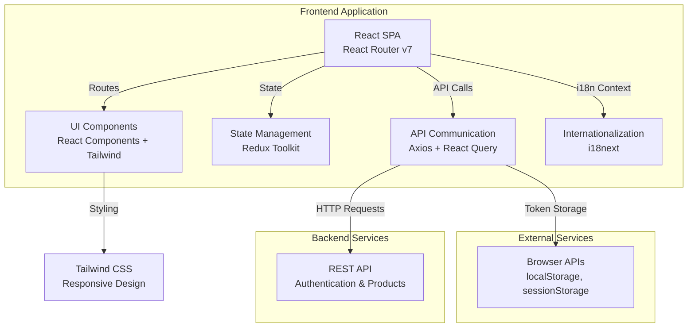
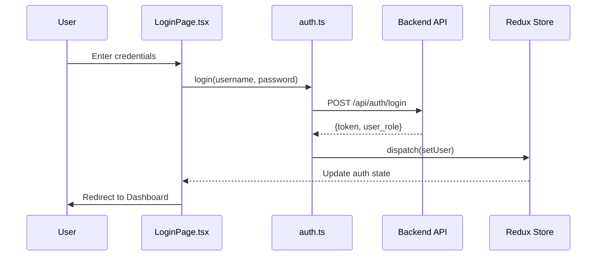
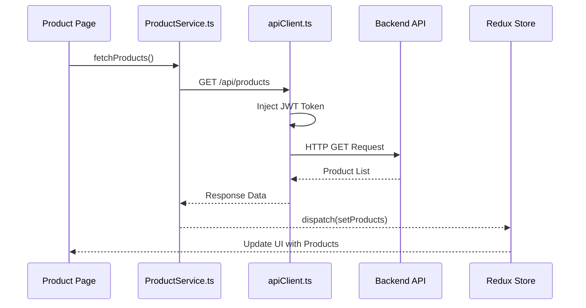

# StockEase Frontend - Architecture Overview

**📖 [Übersicht der Architektur (Deutsch)](./overview.de.md)** - Lesen Sie diese Dokumentation auf Deutsch

## Project Overview

**StockEase Frontend** is a modern, responsive web application built with **React 18** and **TypeScript** that provides inventory management functionality. The application supports multiple languages (English and German), responsive design, and comprehensive testing coverage.

### Key Goals

- **Multi-language Support**: Support English and German through internationalization (i18n)
- **Responsive Design**: Provide seamless experience across desktop and mobile devices
- **Type Safety**: Full TypeScript implementation for maintainability and developer experience
- **Comprehensive Testing**: 478+ unit and integration tests ensuring code quality
- **Enterprise Standards**: Enterprise-grade documentation, error handling, and architectural patterns

---

## Application Architecture

### High-Level Architecture Diagram



---

## Core Technologies

| Technology | Version | Purpose |
|------------|---------|---------|
| **React** | 18.3.1 | UI library and component framework |
| **TypeScript** | ~5.6.2 | Type-safe development |
| **Vite** | 6.0.5 | Build tool and development server |
| **React Router** | 7.1.1 | Client-side routing |
| **Redux Toolkit** | 2.5.0 | State management |
| **Axios** | 1.7.9 | HTTP client |
| **React Query** | 5.62.16 | Server state management |
| **i18next** | 24.2.2 | Internationalization framework |
| **Tailwind CSS** | 3.4.17 | Utility-first CSS framework |
| **Vitest** | 4.0.8 | Unit testing framework |

---

## Project Structure

```
frontend/
├── src/
│   ├── App.tsx                          # Root component with routing
│   ├── main.tsx                         # Application entry point
│   ├── i18n.ts                          # i18next configuration
│   ├── api/                             # API service layer
│   │   ├── auth.ts                      # Authentication endpoints
│   │   └── ProductService.ts            # Product CRUD operations
│   ├── components/                      # Reusable UI components
│   │   ├── Header.tsx
│   │   ├── Sidebar.tsx
│   │   ├── Footer.tsx
│   │   ├── Buttons.tsx
│   │   ├── ErrorBoundary.tsx
│   │   ├── HelpModal.tsx
│   │   └── SkeletonLoader.tsx
│   ├── pages/                           # Page-level components (routed)
│   │   ├── HomePage.tsx
│   │   ├── LoginPage.tsx
│   │   ├── AdminDashboard.tsx
│   │   ├── UserDashboard.tsx
│   │   ├── AddProductPage.tsx
│   │   ├── DeleteProductPage.tsx
│   │   ├── SearchProductPage.tsx
│   │   ├── ListStockPage.tsx
│   │   └── ChangeProductDetailsPage.tsx
│   ├── services/                        # Business logic & integrations
│   │   └── apiClient.ts                 # Configured Axios instance
│   ├── types/                           # TypeScript interfaces & types
│   │   └── Product.ts
│   ├── logic/                           # Business logic hooks
│   │   └── DashboardLogic.ts
│   ├── styles/                          # Global and component styles
│   ├── assets/                          # Images and static assets
│   ├── locales/                         # i18n translation files
│   │   ├── en.json
│   │   ├── de.json
│   │   ├── help_en.json
│   │   └── help_de.json
│   └── __tests__/                       # Test files (mirroring src structure)
│       ├── component/
│       ├── api/
│       ├── auth/
│       ├── a11y/
│       ├── workflows/
│       ├── product-operations/
│       ├── validation-rules/
│       ├── i18n-configuration/
│       ├── api-client-operations/
│       ├── setup.ts
│       └── ... (49+ test files)
├── docs/
│   └── architecture/                    # Architecture documentation
│       ├── overview.md
│       ├── src/
│       ├── pipeline.md
│       └── ...
├── Dockerfile                           # Multi-stage Docker build
├── vite.config.ts                       # Vite configuration
├── vitest.config.ts                     # Vitest configuration
├── tsconfig.json                        # TypeScript root config
├── tailwind.config.js                   # Tailwind CSS configuration
├── package.json                         # Project dependencies
└── .github/
    └── workflows/
        ├── deploy-frontend.yml          # Test & Deploy pipeline
        └── deploy-docs.yml              # Documentation deployment (TBD)
```

---

## Architecture Layers

### 1. **Presentation Layer** (`/components`, `/pages`, `/styles`)

- **Responsibility**: Render UI and handle user interactions
- **Technologies**: React components, Tailwind CSS
- **Pattern**: Component-based architecture with separation of concerns
- **Key Components**: Header, Sidebar, Footer, Modal, Forms

### 2. **Routing Layer** (`App.tsx`, `pages/`)

- **Framework**: React Router v7
- **Pattern**: Declarative route definitions
- **Routes**:
  - `/` → HomePage
  - `/login` → LoginPage
  - `/admin` → AdminDashboard (admin-only)
  - `/user` → UserDashboard (user-only)
  - `/product/*` → Product management pages

### 3. **State Management** (Redux Toolkit)

- **Purpose**: Centralized state for authentication, user data, and application state
- **Pattern**: Slice-based reducers (Redux Toolkit)
- **Scope**: Global state for cross-component communication

### 4. **API Communication Layer** (`/api`, `/services`)

- **HTTP Client**: Axios with custom configuration
- **Features**:
  - JWT token injection in request headers
  - Automatic 401 unauthorized handling
  - Request/response logging
  - Centralized error handling
- **Services**:
  - `auth.ts` → Authentication endpoints
  - `ProductService.ts` → Product CRUD operations

### 5. **Business Logic Layer** (`/logic`, `/services`)

- **Purpose**: Business logic, data transformations, and utility functions
- **Examples**: Dashboard calculations, product filtering, validation rules
- **Pattern**: Custom hooks and utility functions

### 6. **Data Layer** (`/types`)

- **Purpose**: TypeScript interfaces and data contracts
- **Ensures**: Type safety across the application

### 7. **Internationalization Layer** (`/locales`, `i18n.ts`)

- **Framework**: i18next with React integration
- **Languages**: English (en), German (de)
- **Features**: Browser language detection, localStorage persistence
- **Namespaces**: `translation` (general), `help` (help modal)

---

## Data Flow

### Authentication Flow



### Product Data Flow



---

## Key Architectural Decisions

### 1. **React Router v7 for Routing**
- Provides declarative route management
- Supports nested routes and dynamic segments
- Built-in data loading and error handling

### 2. **Redux Toolkit for State Management**
- Centralized state for authentication and app-wide data
- Simplified reducer syntax with Immer integration
- DevTools support for debugging

### 3. **Axios + React Query**
- Axios provides low-level HTTP control
- React Query handles caching and synchronization
- Separation of concerns (HTTP vs data sync)

### 4. **i18next for Internationalization**
- Flexible language loading and switching
- Namespace support for organized translations
- Browser language auto-detection

### 5. **Tailwind CSS for Styling**
- Utility-first approach reduces custom CSS
- Responsive design with mobile-first breakpoints
- Dark mode and theme customization support

### 6. **TypeScript for Type Safety**
- Compile-time error detection
- Better IDE support and refactoring tools
- Self-documenting code

### 7. **Vitest for Testing**
- Fast unit testing with Jest-compatible API
- Built-in coverage reporting
- 478+ tests ensuring code quality

---

## Security Considerations

### Authentication & Authorization

```
1. JWT Token Management
   ├── Stored in localStorage (HttpOnly cookies preferred)
   ├── Automatically injected in Authorization header
   ├── Refreshed on login
   └── Cleared on logout or 401 response

2. Protected Routes
   ├── Admin routes (/admin, /add-product)
   ├── User routes (/user)
   └── Public routes (/, /login)

3. Token Validation
   ├── Server-side signature verification
   ├── Client-side role extraction
   └── Automatic cleanup on expiration
```

### API Security

- **CORS**: Handled by backend
- **HTTPS**: Enforced in production
- **Timeout**: 2-minute request timeout
- **Error Handling**: Sensitive data not logged

---

## Development Workflow

### Local Development

```bash
# Start development server (Vite HMR)
npm run dev

# Run tests in watch mode
npm run test:watch

# Run specific test suite
npm test -- --run

# Generate coverage report
npm run test:coverage

# Build for production
npm run build

# Preview production build
npm run preview
```

### Testing Strategy

- **Unit Tests**: Component logic, utilities, hooks
- **Integration Tests**: API interactions, state management
- **E2E Tests**: User workflows (optional)
- **Accessibility Tests**: WCAG compliance

---

## Deployment Pipeline

### Environment Configuration

| Environment | API Base URL | Build Type | Deployment |
|-------------|--------------|-----------|------------|
| **Local** | http://localhost:8081/api | Development (HMR) | N/A |
| **Development** | API Server | Production | Internal Server |
| **Production** | Production API | Optimized | Docker + nginx |

### Docker Build Process

```dockerfile
Stage 1: Builder
  ├── Node 18 Alpine base
  ├── Install dependencies
  ├── Copy source files (src/, public/, config)
  └── Build production bundle (npm run build)

Stage 2: Production
  ├── nginx Alpine base
  ├── Copy dist/ from builder
  ├── Configure nginx for SPA routing
  └── Expose port 80
```

---

## Future Enhancements

- [ ] Server-side rendering (SSR) with Next.js
- [ ] Progressive Web App (PWA) features
- [ ] Real-time updates with WebSocket
- [ ] Advanced caching strategies
- [ ] Performance monitoring (Sentry, DataDog)
- [ ] E2E testing with Playwright/Cypress

---

## Related Documentation

- [Component Architecture](./src/components.md)
- [API Structure](./src/api.md)
- [Data Flow Patterns](./src/data-flow.md)
- [Testing Strategy](./src/tests.md)
- [CI/CD Pipeline](./pipeline.md)
- [Deployment & Infrastructure](./src/dockerfile.md)
- **Backend Architecture & API Docs** → [StockEase Backend Documentation](https://keglev.github.io/stockease/)

---

**Last Updated**: November 2025  
**Maintained By**: Development Team  
**Version**: 1.0
