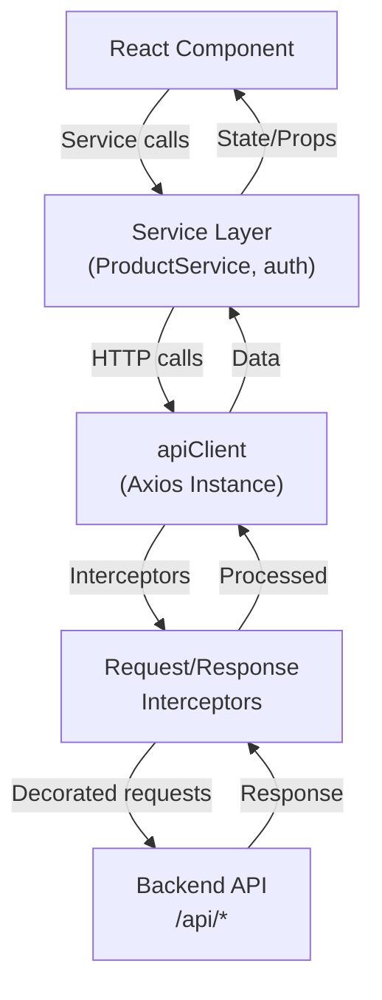
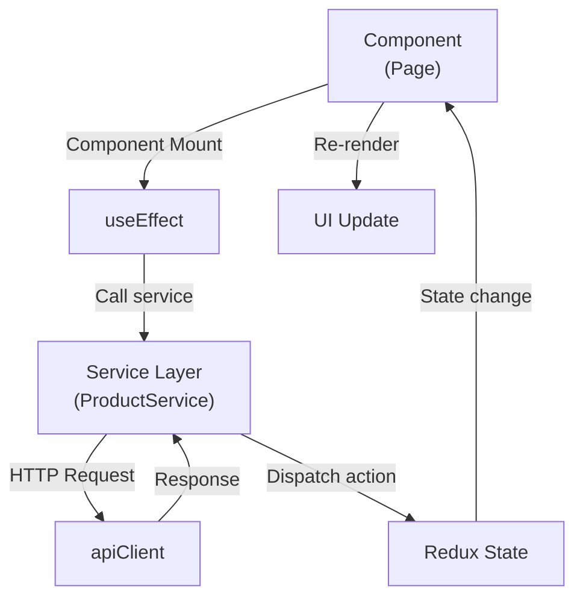
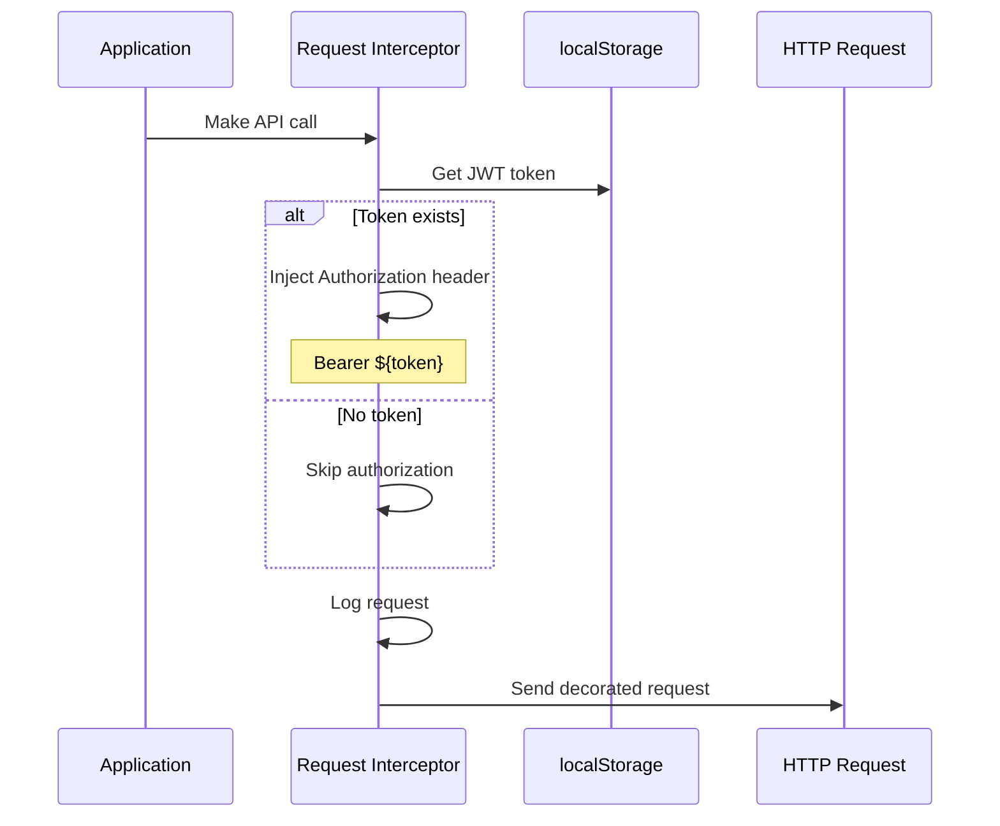
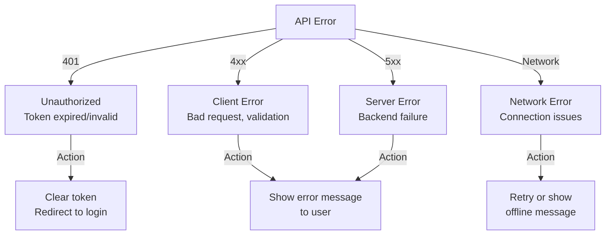

# API Architecture & Integration Overview

## Quick Navigation

- **[Architecture Overview](./overview.md)** (this file)
- **[HTTP Client Configuration](./client.md)** - apiClient setup and interceptors
- **[Authentication Service](./auth.md)** - Login, JWT token handling
- **[Product Service](./product-service.md)** - Product CRUD operations
- **[Error Handling & Security](./error-handling.md)** - Error patterns, security practices
- **[Testing API Layer](./testing.md)** - API testing strategies and patterns

---

## Overview

The API layer provides a clean abstraction for backend communication with centralized authentication, error handling, and request/response logging. The architecture uses **Axios** as the HTTP client with custom interceptors.

### Key Features

- **JWT Authentication**: Automatic token injection and management
- **Centralized Configuration**: Single source of truth for API setup
- **Request Logging**: All requests/responses logged for debugging
- **Error Handling**: 401 unauthorized automatic cleanup
- **Type Safety**: Full TypeScript support with interfaces

---

## Architecture Diagram



---

## Core Components

### 1. **HTTP Client** (`apiClient.ts`)

The configured Axios instance handling all HTTP communication.

- Base URL configuration from environment
- Request/response interceptors
- JWT token injection
- Error handling and 401 cleanup
- 2-minute request timeout

**[Read more →](./client.md)**

### 2. **Authentication Service** (`auth.ts`)

Handles user login and JWT token management.

- Login endpoint integration
- JWT token extraction and storage
- Role-based authorization
- Token cleanup on logout/401

**[Read more →](./auth.md)**

### 3. **Product Service** (`ProductService.ts`)

Abstracts all product-related API operations.

- GET all products (paginated and unpaginated)
- POST create new product
- DELETE product
- SEARCH by name
- UPDATE product price and quantity

**[Read more →](./product-service.md)**

---

## Data Flow Patterns

### Typical API Call Pattern



### Request Interceptor Flow



---

## Error Handling Strategy

### Error Categories



**[Read more →](./error-handling.md)**

---

## Security Practices

| Practice | Implementation |
|----------|-----------------|
| **Token Storage** | localStorage (HttpOnly cookies preferred) |
| **Token Injection** | Automatic via request interceptor |
| **Token Cleanup** | Automatic on logout or 401 response |
| **HTTPS** | Enforced in production |
| **CORS** | Handled by backend |
| **Timeout** | 2-minute request timeout |
| **Logging** | Sensitive data not logged |

**[Read more →](./error-handling.md)**

---

## Environment Configuration

### Environment Variables

```bash
# Development
VITE_API_BASE_URL=http://localhost:8081/api

# Production
VITE_API_BASE_URL=https://api.stockease.com/api
```

### Configuration Loading

```typescript
const baseURL = import.meta.env.VITE_API_BASE_URL || 'http://localhost:8081/api';
```

---

## Performance Considerations

### Request Caching
Products cached in Redux to avoid redundant API calls.

### Pagination
Large datasets use pagination for better performance.

### Request Debouncing
Search requests debounced to prevent excessive API calls (300ms delay).

---

## Testing the API Layer

The API layer has comprehensive test coverage including:

- Client configuration and setup
- Request/response interceptors
- Authentication flow
- Error scenarios
- Product CRUD operations
- Security and authorization

**[Read more →](./testing.md)**

---

## Quick Reference

### Making API Calls

```typescript
// Import the service
import ProductService from '@/api/ProductService';

// Call a method
const products = await ProductService.fetchProducts();

// In a component with error handling
useEffect(() => {
  ProductService.fetchProducts()
    .then(data => dispatch(setProducts(data)))
    .catch(error => dispatch(setError(error.message)));
}, [dispatch]);
```

### JWT Token Handling

Token is automatically:
- Extracted from login response
- Stored in localStorage
- Injected in all API requests
- Cleared on logout or 401 error

---

## Related Documentation

- [Components Architecture](../components/overview.md)
- [Services Layer](../services/overview.md)
- [Testing Strategy](../tests/overview.md)
- [Main Architecture Overview](../../overview.md)

---

**Last Updated**: November 2025  
**API Version**: v1.0

