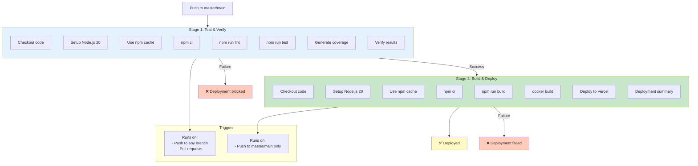

# CI/CD Pipeline & GitHub Actions

## Overview

The Docker build and deployment process is fully automated using GitHub Actions. The pipeline runs tests, builds the application, creates a Docker image, and deploys to production automatically on every push to the master/main branch.

---

## GitHub Actions Workflow Improvements

### Enhanced Documentation

The `deploy-frontend.yml` workflow includes:
- Clear purpose statements for each stage
- When each stage runs (push vs PR, master/main only)
- What causes pipeline failure
- Required secrets and environment variables
- Error messages with troubleshooting tips

### Better Naming

- Changed "Use Node.js 20" to "Setup Node.js 20"
- Changed "Check test results" to "Verify test results"
- More descriptive deploy step comments

### Improved Error Handling

- Better error messages explaining what went wrong
- Troubleshooting tips in failure messages
- Clear indication of required secrets

---

## Workflow Structure

### Two-Stage Pipeline

The deployment pipeline has two distinct stages with different triggers and purposes:



---

## Stage 1: Test & Verify (Always Runs)

**Trigger**: Every commit and pull request to any branch

**Purpose**: Ensure code quality and prevent broken code from being deployed

### Steps

```yaml
1. Checkout code
   └─ Gets the latest code from repository

2. Setup Node.js 20
   └─ Installs Node.js runtime environment

3. Use npm cache
   └─ Speeds up dependency installation

4. Install dependencies
   └─ npm ci (clean install for reproducibility)
   └─ Installs all project dependencies

5. Run linter
   └─ npm run lint (ESLint)
   └─ Checks code style and quality

6. Run tests
   └─ npm run test (Vitest)
   └─ Runs 478+ unit and integration tests

7. Generate coverage report
   └─ Vitest coverage analysis
   └─ Ensures adequate test coverage

8. Verify test results
   └─ Fails if tests fail
   └─ Fails if linting issues found
```

### Key Features

✅ **Runs on all commits** - Including pull requests  
✅ **Fast feedback** - Developers see failures immediately  
✅ **Prevents bad code** - Broken code can't reach production  
✅ **npm caching** - Speeds up repeated runs  
✅ **Coverage tracking** - Maintains test quality  

### Example Output

```
✓ Checkout code
✓ Setup Node.js 20
✓ Use npm cache
✓ Install dependencies (15 seconds)
✓ Run linter (8 seconds)
  ├─ No ESLint errors found
✓ Run tests (45 seconds)
  ├─ Passed: 478 tests
  ├─ Failed: 0 tests
✓ Generate coverage report
  ├─ Coverage: 87%
✓ Verify test results
  └─ All tests passed!
```

---

## Stage 2: Build & Deploy (Protected)

**Trigger**: Only on push to `master` or `main` branch

**Runs After**: Stage 1 succeeds

**Purpose**: Build production bundle and deploy to Vercel

### Steps

```yaml
1. Checkout code
   └─ Gets the latest code

2. Setup Node.js 20
   └─ Installs Node.js runtime

3. Use npm cache
   └─ Speeds up builds

4. Install dependencies
   └─ npm ci (same as Stage 1)

5. Build production bundle
   └─ npm run build (Vite)
   └─ Creates optimized dist/ directory
   └─ Minifies and bundles code
   └─ Optimizes assets

6. Verify build output
   └─ Checks dist/ directory exists
   └─ Verifies build artifacts
   └─ Fails if build errors

7. Build Docker image
   └─ docker build (optional - for testing)
   └─ Creates container image
   └─ Tests multi-stage build

8. Deploy to Vercel
   └─ Pushes production build
   └─ Triggers Vercel deployment
   └─ Makes app live

9. Deployment summary
   └─ Shows deployment URL
   └─ Logs build time
   └─ Provides rollback info
```

### Key Features

✅ **Master/main only** - Production only from main branch  
✅ **Depends on Stage 1** - Can't deploy if tests fail  
✅ **Docker verification** - Tests build before deployment  
✅ **Automated deployment** - No manual steps needed  
✅ **Clear summary** - Shows deployment status  

### Example Output

```
✓ Checkout code
✓ Setup Node.js 20
✓ Use npm cache
✓ Install dependencies (15 seconds)
✓ Build production bundle (35 seconds)
  ├─ dist/index.html: 2.5KB
  ├─ dist/assets/index.js: 485KB
  ├─ dist/assets/vendor.js: 250KB
  └─ dist/assets/index.css: 45KB
✓ Verify build output
  ├─ dist/ directory found
  ├─ All expected files present
✓ Build Docker image (30 seconds)
  ├─ Image size: 45MB
  ├─ Layers: 5
✓ Deploy to Vercel (20 seconds)
  ├─ Build ID: abc123def456
  ├─ URL: https://stockease-...vercel.app
✓ Deployment summary
  └─ ✅ Deployed to production
```

---

## Conditional Execution Logic

### When Tests Run

```yaml
on:
  push:
    branches: [ master, main ]
  pull_request:
    branches: [ master, main ]
```

| Event | Test Stage | Deploy Stage |
|-------|-----------|--------------|
| Push to master/main | ✅ Runs | ✅ Runs (if tests pass) |
| Push to feature branch | ✅ Runs | ❌ Skipped |
| Pull request | ✅ Runs | ❌ Skipped |
| Direct commit to master | ✅ Runs | ✅ Runs (if tests pass) |
| Draft PR | ✅ Runs | ❌ Skipped |

### Deployment Protection

```yaml
if: success() && github.ref == 'refs/heads/master'
```

**Deployment only happens when**:
1. All tests pass
2. Push is to master/main branch
3. No failures in previous stages
4. Commit is on main branch (not PR)

---

## Required Configuration

### Secrets

Two secrets must be configured in GitHub repository settings:

| Secret | Purpose | Where to Get |
|--------|---------|--------------|
| `VERCEL_TOKEN` | Authentication for Vercel deployment | [Vercel Settings](https://vercel.com/account/tokens) |
| `FRONTEND_API_BASE_URL` | Production API endpoint | Your backend API URL |

### Environment Variables

```yaml
VITE_API_BASE_URL: ${{ secrets.FRONTEND_API_BASE_URL }}
NODE_ENV: production
```

### GitHub Actions Permissions

The workflow needs:
- Read access to repository code
- Write access to deployment status
- Secrets access (automatic)

---

## Error Handling

### Test Failures

If tests fail, the pipeline stops before deployment:

```
❌ npm run test FAILED
  └─ Error: 2 tests failed
     ├─ LoginPage should render login form
     └─ Dashboard should handle API errors
  
  Action: Fix the failing tests before pushing again
```

### Build Failures

If the build fails, deployment is blocked:

```
❌ npm run build FAILED
  └─ Error: TypeScript compilation error
     └─ src/components/Button.tsx:15: Type 'string' is not assignable to type 'number'
  
  Action: Fix the TypeScript error
```

### Deployment Failures

If Vercel deployment fails, you're notified:

```
❌ Deploy to Vercel FAILED
  └─ Error: Deployment quota exceeded
  
  Action: Check Vercel dashboard or contact support
```

---

## Monitoring & Debugging

### View Workflow Status

1. Go to GitHub repository
2. Click "Actions" tab
3. Click workflow run to see details
4. Click job to see step-by-step output

### Common Issues & Solutions

#### Tests Failing

```bash
# Run tests locally first
npm run test

# Check linting
npm run lint

# Then push
git push origin feature-branch
```

#### Build Failing

```bash
# Build locally to verify
npm run build

# Check for build errors
npm run build -- --show-error

# Then push
git push
```

#### Deployment Not Triggering

```bash
# Ensure you're pushing to master/main
git push origin master

# Not to a feature branch
# (deployment won't trigger on feature branches)
```

---

## Performance Metrics

### Typical Pipeline Times

| Stage | Time | Notes |
|-------|------|-------|
| Test Stage | 60-90 seconds | Includes npm install, lint, tests |
| Build Stage | 50-70 seconds | Includes npm install, build, Docker build |
| Deploy Stage | 20-40 seconds | Vercel deployment |
| **Total** | **2-3 minutes** | From push to live |

### Optimization

- **npm cache**: Reduces install time from 30s → 10s
- **Layer caching**: Docker reuses dependencies layer
- **Parallel execution**: Tests run in parallel (if configured)

---

## Best Practices

### 1. Commit Frequently

Push changes regularly to get fast feedback:

```bash
git commit -m "feat: add user profile page"
git push origin feature-branch
```

### 2. Keep Tests Passing

Don't push code with failing tests:

```bash
# Always run locally first
npm run test
npm run lint

# Then push
git push
```

### 3. Use Meaningful Commit Messages

```bash
# Good
git commit -m "fix: handle API timeout in product list"

# Bad
git commit -m "fix stuff"
```

### 4. Create Pull Requests

Don't push directly to master:

```bash
# Create feature branch
git checkout -b feature/add-search

# Work and push
git push origin feature/add-search

# Create PR on GitHub
# Let tests run on PR
# Get review
# Merge to master
```

### 5. Monitor Deployments

Check GitHub Actions and Vercel dashboards after merging:

```bash
# Check Actions
open https://github.com/Keglev/stockease-frontend/actions

# Check Vercel
open https://vercel.com/keglev/stockease-frontend
```

---

## Deployment Workflow

### Complete Development Cycle

```
1. Create feature branch
   git checkout -b feature/new-feature

2. Make changes
   Edit files, commit regularly

3. Run tests locally
   npm run test
   npm run lint

4. Push to GitHub
   git push origin feature/new-feature

5. Create Pull Request
   - Tests run on PR
   - Get code review
   - Fix any issues

6. Merge to master
   - Tests run again
   - If all pass, deploy starts

7. Vercel deployment
   - Build happens
   - Tests in production
   - App goes live

8. Monitor
   - Check Vercel dashboard
   - Monitor error tracking
   - Watch logs
```

---

## Troubleshooting

### Pipeline Not Running

**Check**:
1. Branch is master/main
2. Pushed to GitHub (not just committed locally)
3. `.github/workflows/deploy-frontend.yml` exists
4. Repository settings allow Actions

**Fix**:
```bash
# Verify remote is GitHub
git remote -v

# Push again
git push origin master
```

### Deployment Stuck

**Check**:
1. GitHub Actions status
2. Vercel deployment status
3. Check for hanging processes

**Fix**:
```bash
# Cancel workflow on GitHub (Actions tab)
# Then push again
git push origin master
```

### API Errors After Deployment

**Check**:
1. `VITE_API_BASE_URL` is correct
2. API server is running
3. CORS is configured correctly

**Fix**:
```bash
# Check what URL is in the build
docker run your-image:latest cat /usr/share/nginx/html/assets/*.js | grep api

# Rebuild with correct URL
docker build --build-arg VITE_API_BASE_URL=https://api.correct.com .
```

---

## Related Documentation

- [Docker Overview](./overview.md)
- [Build Stage](./build-stage.md)
- [Production Stage](./production-stage.md)
- [Configuration](./configuration.md)
- [Local Usage](./local-usage.md)
- [Security & Performance](./security-performance.md)
- [Main Pipeline Documentation](../pipeline/overview.md)
- [GitHub Actions Official Docs](https://docs.github.com/en/actions)

---

**Last Updated**: November 12, 2025  
**Status**: ✅ Production Ready  
**Maintenance**: Automated via GitHub Actions
