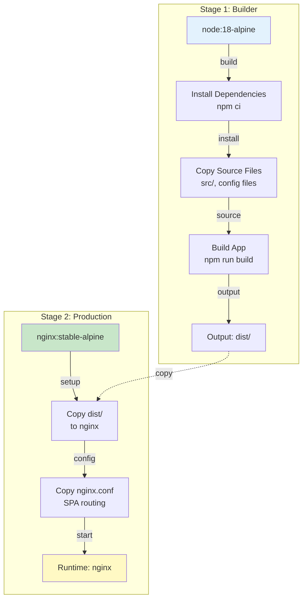
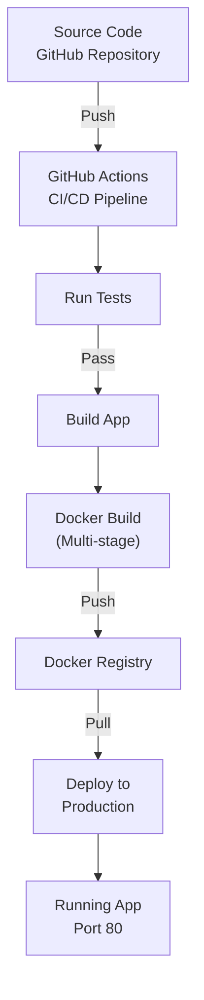

# Docker Containerization & Deployment

## Overview

StockEase Frontend uses **multi-stage Docker builds** to create optimized production containers. The build process compiles the React application and serves it via nginx, minimizing image size and improving startup time.

### Key Features

- **Multi-Stage Build**: Reduces final image size by excluding build artifacts
- **Alpine Linux**: Small base images for both Node.js and nginx
- **Build Argument**: Runtime API configuration
- **SPA Routing**: nginx configured for client-side routing
- **Security**: Non-root execution and minimal dependencies

---

## Dockerfile Architecture

### Multi-Stage Build Diagram



---

## Build Stages

The Docker build uses two stages to optimize final image size:

### Stage 1: Builder

**Base Image**: `node:18-alpine` (~180MB)

**Purpose**: Compile TypeScript, bundle JavaScript, optimize assets

- Install dependencies
- Copy source files
- Run build process
- Output: optimized `dist/` directory

See [Build Stage Details](./build-stage.md) for complete information.

### Stage 2: Production (nginx)

**Base Image**: `nginx:stable-alpine` (~41MB)

**Purpose**: Serve built application via web server

- Copy optimized dist/ files
- Configure nginx for SPA routing
- Run production server
- **Final size**: ~45MB (no Node.js, no build tools)

See [Production Stage Details](./production-stage.md) for complete information.

---

## Key Components

### Build Arguments & Configuration

Environment variables can be passed at build time for different deployments:

| Variable | Purpose | Example |
|----------|---------|---------|
| VITE_API_BASE_URL | Production API endpoint | `https://api.stockease.com` |
| NODE_ENV | Build environment | production |

See [Build Configuration](./configuration.md) for detailed setup.

### nginx Configuration for SPA Routing

The nginx configuration enables client-side routing without 404 errors on non-root paths:

```
/assets/... (static files)  → Serve with cache headers
/admin, /user, etc.        → Serve index.html → React Router handles
```

See [SPA Routing Details](./configuration.md#spa-routing) for complete configuration.

### .dockerignore

Excludes unnecessary files from the Docker build context, improving build speed:

- Tests and coverage files
- Documentation
- Git files and IDE config
- Node modules (reinstalled)

See [Build Configuration](./configuration.md#dockerignore) for complete list.

---

## Deployment Workflow



---

## Quick Links

- 📦 [Build Stage Details](./build-stage.md) - Node.js builder configuration
- 🚀 [Production Stage Details](./production-stage.md) - nginx runtime configuration
- ⚙️ [Build Configuration](./configuration.md) - Build args, dockerignore, SPA routing
- 🔧 [Running Locally](./local-usage.md) - Docker commands and docker-compose
- 🛡️ [Security & Performance](./security-performance.md) - Optimization and best practices
- � [CI/CD Pipeline](./ci-cd.md) - GitHub Actions workflow and automation
- �🐛 [Troubleshooting](./troubleshooting.md) - Common issues and solutions

---

## Performance Summary

| Metric | Value |
|--------|-------|
| Final Image Size | ~45MB |
| Build Time | 1-2 minutes (fresh) / 30-40s (cached) |
| Container Startup | <2 seconds |
| Memory Usage | 50-100MB |
| Response Time | <100ms |
| Concurrent Connections | 1000+ |

---

## Architecture Comparison

### Development
- Vite dev server with hot reload
- Full source maps
- Slower build, faster iteration

### Production (Docker)
- Optimized bundle
- Minimal dependencies
- Fast startup, efficient serving

---

## Related Documentation

- [CI/CD Pipeline](../pipeline/overview.md)
- [Main Overview](../overview.md)
- [GitHub Actions CI/CD](../pipeline/overview.md)
- [Official Docker Docs](https://docs.docker.com/)

---

**Last Updated**: November 2025  
**Node Version**: 18 Alpine  
**nginx Version**: Stable Alpine  
**Final Image Size**: ~45MB

