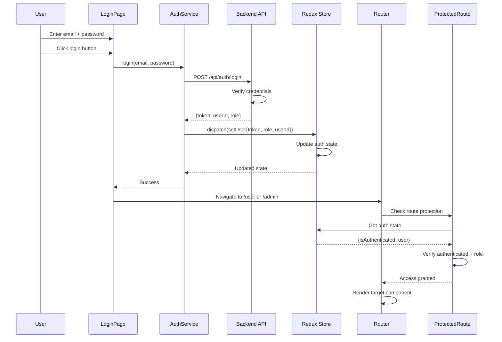
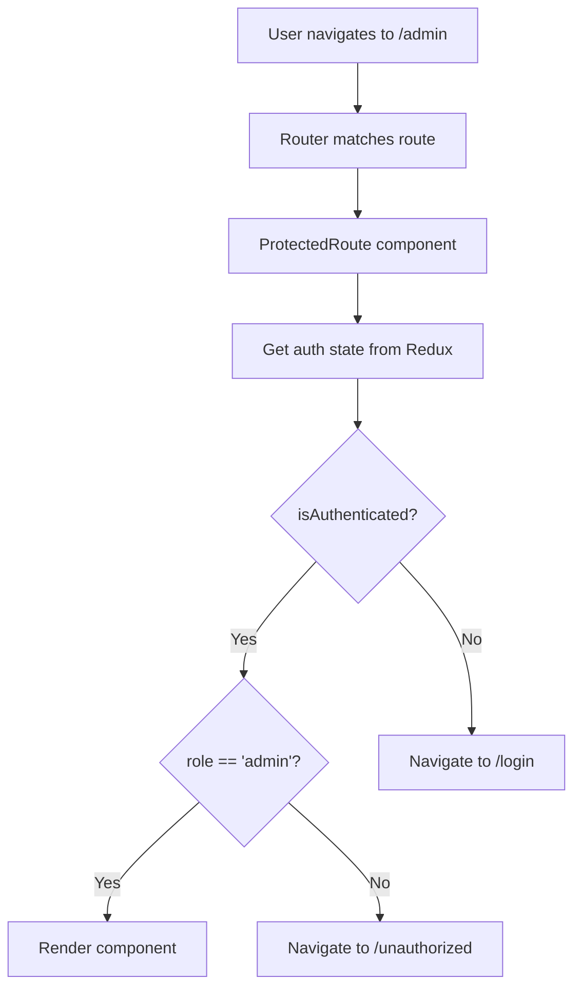

# Authentication & Route Protection

## Route Protection Overview

StockEase uses role-based access control (RBAC) to protect routes. Different pages require different authentication levels.

---

## Access Levels

### 1. Public Routes (No Authentication Required)

```typescript
<Route path="/" element={<HomePage />} />
<Route path="/login" element={<LoginPage />} />
```

**Pages**:
- HomePage
- LoginPage

**Behavior**:
- Accessible to everyone
- Logged-in users should be redirected away from LoginPage

---

### 2. Protected Routes (Login Required)

```typescript
<Route 
  path="/user" 
  element={<ProtectedRoute component={UserDashboard} />} 
/>
```

**Pages**:
- UserDashboard
- SearchProductPage
- ListStockPage

**Requirements**:
- User must be authenticated
- Any logged-in user (admin or regular user) can access

**Redirect behavior**:
- Not authenticated → Redirect to `/login`
- Authenticated → Allow access

---

### 3. Admin-Only Routes (Admin Role Required)

```typescript
<Route 
  path="/admin" 
  element={<ProtectedRoute component={AdminDashboard} requiredRole="admin" />} 
/>
```

**Pages**:
- AdminDashboard
- AddProductPage
- DeleteProductPage
- ChangeProductDetailsPage

**Requirements**:
- User must be authenticated
- User must have "admin" role

**Redirect behavior**:
- Not authenticated → Redirect to `/login`
- Not admin → Redirect to `/unauthorized` or UserDashboard

---

## ProtectedRoute Component

### Implementation

```typescript
/**
 * ProtectedRoute.tsx
 * 
 * Higher-order component wrapper for protecting routes based on
 * authentication status and user role.
 */

import React from 'react';
import { Navigate } from 'react-router-dom';
import { useSelector } from 'react-redux';

interface ProtectedRouteProps {
  component: React.ComponentType<any>;
  requiredRole?: 'admin' | 'user';
}

export const ProtectedRoute: React.FC<ProtectedRouteProps> = ({
  component: Component,
  requiredRole,
}) => {
  // Get authentication state from Redux
  const { user, isAuthenticated } = useSelector(
    state => state.auth
  );
  
  // Step 1: Check if user is authenticated
  if (!isAuthenticated) {
    // Not logged in - redirect to login
    return <Navigate to="/login" replace />;
  }
  
  // Step 2: Check if user has required role (if specified)
  if (requiredRole && user?.role !== requiredRole) {
    // Wrong role - redirect to unauthorized page
    return <Navigate to="/unauthorized" replace />;
  }
  
  // Step 3: All checks passed - render component
  return <Component />;
};

export default ProtectedRoute;
```

### Usage in Routes

```typescript
// Protected route - all authenticated users
<Route 
  path="/user" 
  element={<ProtectedRoute component={UserDashboard} />} 
/>

// Admin-only route - requires admin role
<Route 
  path="/admin" 
  element={
    <ProtectedRoute 
      component={AdminDashboard} 
      requiredRole="admin" 
    />
  } 
/>

// Admin-only with role check
<Route 
  path="/add-product" 
  element={
    <ProtectedRoute 
      component={AddProductPage} 
      requiredRole="admin" 
    />
  } 
/>
```

---

## In-Page Authentication Check

Some pages implement their own authentication check as an additional safety layer:

```typescript
/**
 * UserDashboard.tsx
 * 
 * Page performs its own authentication check as a safety measure,
 * even though the route is protected.
 */

const UserDashboard: React.FC = () => {
  const { user, isAuthenticated } = useSelector(state => state.auth);
  
  // Safety check: verify authentication
  if (!isAuthenticated) {
    return <Navigate to="/login" />;
  }
  
  // Rest of component...
};
```

### Why Double-Check?

1. **Defense in depth**: Extra safety layer
2. **Direct page access**: If someone navigates directly (bookmarks)
3. **Session expiration**: Catch expired sessions mid-page

---

## Authentication Flow

### Complete Login Flow



### Access Attempt Flow



---

## User Roles

### Admin Role

```typescript
interface AdminUser {
  userId: string;
  email: string;
  role: 'admin';     // Special role
  permissions: [
    'create_product',
    'edit_product',
    'delete_product',
    'view_all_products',
    'manage_users'     // optional
  ];
}
```

**Access**: All pages including admin-only pages

**Capabilities**:
- Add products
- Edit products
- Delete products
- View all products
- Access AdminDashboard

### User Role

```typescript
interface RegularUser {
  userId: string;
  email: string;
  role: 'user';      // Regular user role
  permissions: [
    'view_own_products',
    'search_products',
    'list_products'
  ];
}
```

**Access**: Protected pages only

**Capabilities**:
- View own products (UserDashboard)
- Search products (SearchProductPage)
- View inventory list (ListStockPage)
- Cannot create/edit/delete

---

## Token Management

### Saving Auth Token

```typescript
/**
 * After successful login, store token in localStorage
 */

const handleLoginSuccess = (response) => {
  const { token, role, userId } = response;
  
  // Store token securely
  localStorage.setItem('authToken', token);
  localStorage.setItem('userRole', role);
  localStorage.setItem('userId', userId);
  
  // Update Redux
  dispatch({
    type: 'SET_USER',
    payload: { token, role, userId }
  });
};
```

### Using Auth Token in API Calls

```typescript
/**
 * Add token to all API requests
 */

// In apiClient.ts
const apiClient = axios.create({
  baseURL: process.env.VITE_API_BASE_URL
});

apiClient.interceptors.request.use(config => {
  const token = localStorage.getItem('authToken');
  
  if (token) {
    config.headers.Authorization = `Bearer ${token}`;
  }
  
  return config;
});

// All API calls automatically include token
await apiClient.get('/api/products');
```

### Token Expiration Handling

```typescript
// In apiClient interceptor
apiClient.interceptors.response.use(
  response => response,
  error => {
    if (error.response?.status === 401) {
      // Token expired or invalid
      localStorage.removeItem('authToken');
      dispatch({ type: 'LOGOUT' });
      window.location.href = '/login';
    }
    return Promise.reject(error);
  }
);
```

---

## Logout Flow

```typescript
const handleLogout = () => {
  // 1. Clear Redux store
  dispatch({ type: 'LOGOUT' });
  
  // 2. Clear localStorage
  localStorage.removeItem('authToken');
  localStorage.removeItem('userRole');
  localStorage.removeItem('userId');
  
  // 3. Navigate to login
  navigate('/login');
};
```

---

## Unauthorized Page

### Component for Access Denied

```typescript
/**
 * UnauthorizedPage.tsx
 * Shown when user lacks required role
 */

const UnauthorizedPage: React.FC = () => {
  const { t } = useTranslation();
  
  return (
    <div className="unauthorized">
      <h1>{t('error.unauthorized')}</h1>
      <p>{t('error.insufficient_permissions')}</p>
      
      <div className="actions">
        <button onClick={() => navigate('/user')}>
          {t('buttons.go_to_dashboard')}
        </button>
        <button onClick={() => navigate(-1)}>
          {t('buttons.go_back')}
        </button>
      </div>
    </div>
  );
};
```

### Route for Unauthorized

```typescript
<Route path="/unauthorized" element={<UnauthorizedPage />} />
```

---

## Session Management

### Session Persistence

```typescript
/**
 * App.tsx - On app load, restore session
 */

useEffect(() => {
  const initializeAuth = () => {
    const token = localStorage.getItem('authToken');
    const role = localStorage.getItem('userRole');
    const userId = localStorage.getItem('userId');
    
    if (token && userId) {
      // Restore session
      dispatch({
        type: 'SET_USER',
        payload: { token, role, userId }
      });
    }
  };
  
  initializeAuth();
}, [dispatch]);
```

### Session Timeout (Optional)

```typescript
/**
 * Logout user after inactivity period
 */

useEffect(() => {
  const TIMEOUT = 30 * 60 * 1000; // 30 minutes
  let timeoutId: NodeJS.Timeout;
  
  const resetTimeout = () => {
    clearTimeout(timeoutId);
    timeoutId = setTimeout(() => {
      dispatch({ type: 'LOGOUT' });
      navigate('/login');
    }, TIMEOUT);
  };
  
  window.addEventListener('mousemove', resetTimeout);
  window.addEventListener('keypress', resetTimeout);
  
  resetTimeout();
  
  return () => {
    window.removeEventListener('mousemove', resetTimeout);
    window.removeEventListener('keypress', resetTimeout);
    clearTimeout(timeoutId);
  };
}, [dispatch, navigate]);
```

---

## Security Best Practices

### ✅ DO:

```typescript
// Store token securely
localStorage.setItem('authToken', token);

// Check authentication on protected pages
if (!isAuthenticated) return <Navigate to="/login" />;

// Include token in API requests
headers: { Authorization: `Bearer ${token}` }

// Clear token on logout
localStorage.removeItem('authToken');

// Verify role for admin pages
if (user.role !== 'admin') return <Navigate to="/unauthorized" />;
```

### ❌ DON'T:

```typescript
// Don't expose token in URLs
window.location = `/dashboard?token=${token}`;

// Don't hardcode credentials
const password = 'admin123';

// Don't skip authentication checks
<Route path="/admin" element={<AdminDashboard />} />

// Don't store sensitive data in Redux alone
// Always persist to secure storage

// Don't pass credentials in request body for auth
// Use headers and tokens instead
```

---

## Related Documentation

- [Overview](./overview.md) - Routing structure and pages
- [Page Components](./components.md) - Individual page details
- [Page Lifecycle](./lifecycle.md) - Component patterns and structure
- [Performance](./performance.md) - Optimization techniques
- [Testing](./testing.md) - Testing protected routes

---

**Last Updated**: November 2025

