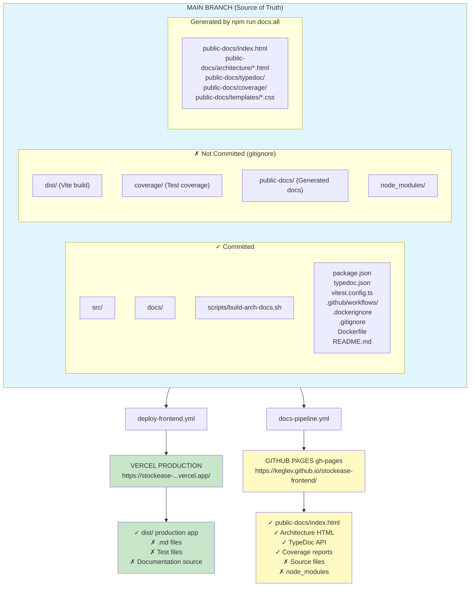
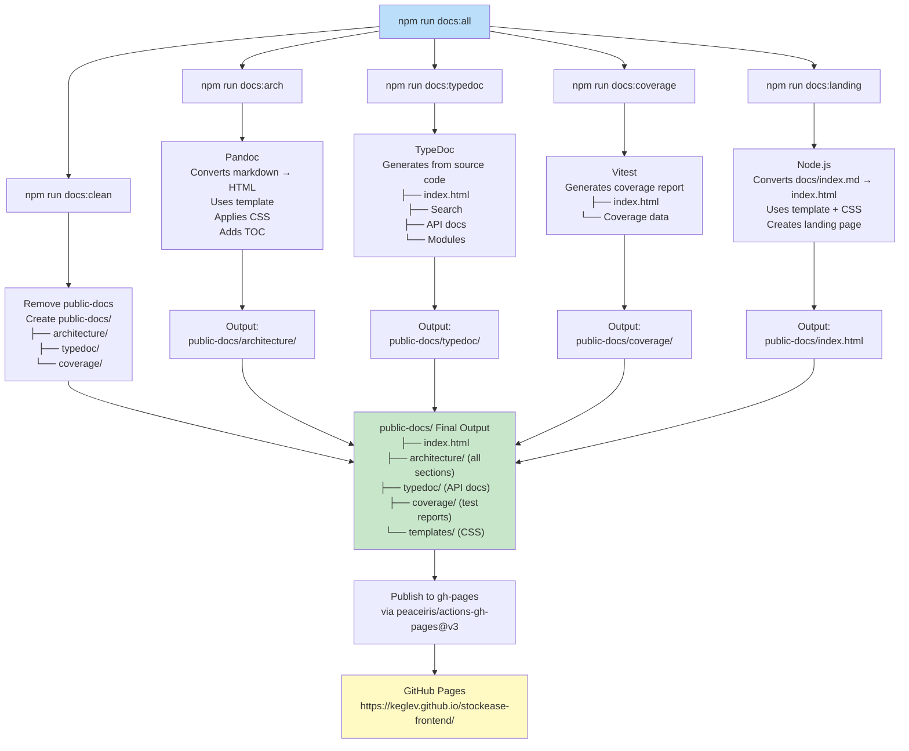
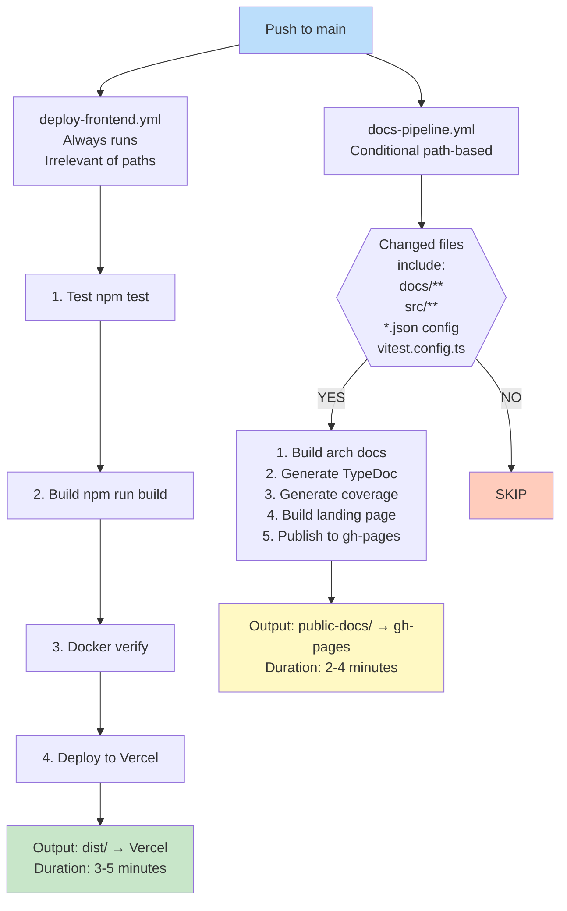
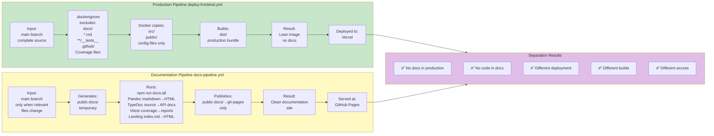
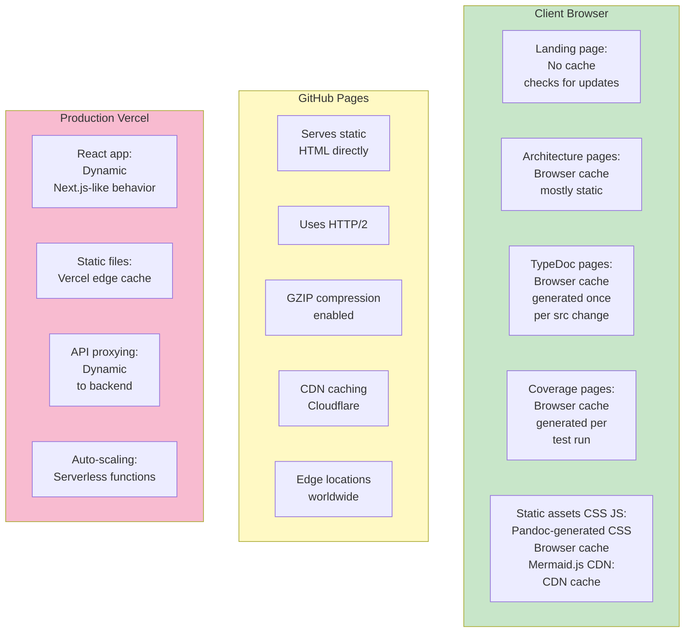

# Documentation Pipeline Architecture

## System Overview



---

## File Generation Pipeline



---

## Workflow Decision Tree



---

## Security & Isolation



---

## Caching & Performance



---

## Change Detection Logic

### docs-pipeline.yml triggers when:

| Trigger | Action | Result |
|---------|--------|--------|
| `docs/architecture/*.md` changed | ✅ Rebuild architecture HTML | Docs updated |
| `src/*.ts` or `src/*.tsx` changed | ✅ Regenerate TypeDoc | API docs updated |
| `vitest.config.ts` changed | ✅ Rebuild with new config | Coverage updated |
| `typedoc.json` changed | ✅ Rebuild with new config | API docs updated |
| `package.json` or `package-lock.json` changed | ✅ Rebuild | Dependencies may affect docs |
| Only tests changed `*.test.ts` | ⏭️ SKIPPED | No docs rebuild needed |
| Only linting changed `.eslintrc` | ⏭️ SKIPPED | No docs rebuild needed |
| Only production code `src/main.tsx` | ⏭️ SKIPPED | No docs rebuild needed |
| Only workflows changed | ⏭️ SKIPPED | No docs rebuild needed |

This prevents unnecessary documentation rebuilds when they're not needed.

---

## Link Resolution Logic

Generated HTML uses JavaScript to resolve paths dynamically:

```javascript
function getRootFrom(pathname) {
  // Example paths:
  // /stockease-frontend/index.html
  //   → root = ./
  // /stockease-frontend/architecture/overview.html
  //   → root = ../
  // /stockease-frontend/architecture/api/overview.html
  //   → root = ../../
  
  // Works under any subdomain:
  // https://keglev.github.io/stockease-frontend/ ✅
  // https://custom.com/docs/stockease/ ✅
  // https://docs.stockease.example.com/ ✅
}

CSS Path: ${root} + templates/frontend-docs.css
Home Link: ${root} + index.html
API Link: ${root} + typedoc/index.html
Coverage Link: ${root} + coverage/index.html
```

---

## Summary

This architecture provides:

✅ **Complete Separation**: Docs and production never mix  
✅ **Automated Generation**: All docs built on every relevant change  
✅ **Targeted Triggers**: Only runs when needed  
✅ **Clean Distribution**: Each system gets exactly what it needs  
✅ **Security**: No documentation in production code  
✅ **Performance**: Lean images, efficient pipelines  
✅ **Scalability**: GitHub Pages handles docs, Vercel handles app  
✅ **Maintenance**: Single source of truth (main branch)  

---

Generated: November 12, 2025
