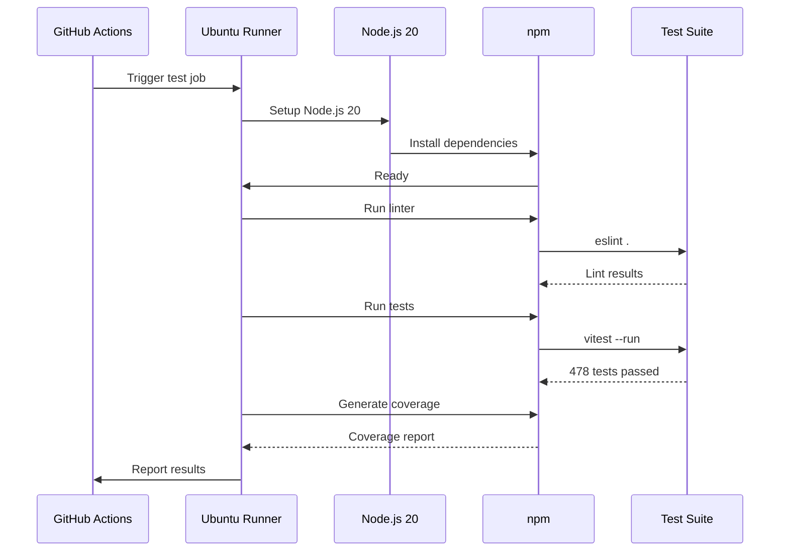

# Stage 1: Testing & Quality Checks

## Overview

The testing stage runs on all commits and pull requests. It ensures code quality through linting and comprehensive test validation.

**Duration**: 30-40 seconds  
**Runs on**: All PRs and pushes to master/main

---

## Test Job Flow



---

## Pipeline Configuration

```yaml
name: Test & Build & Deploy Frontend
on:
  push:
    branches: [ master, main ]
  pull_request:
    branches: [ master, main ]
```

### Triggers

| Event | Action |
|-------|--------|
| **Push to master/main** | Run tests → Build → Deploy |
| **PR to master/main** | Run tests → Report results |
| **Push to other branches** | No action |

---

## Test Job Steps

### 1. Checkout Repository

```yaml
- uses: actions/checkout@v4
```

- Clones repository
- Sets up git context

### 2. Setup Node.js

```yaml
- uses: actions/setup-node@v4
  with:
    node-version: '20'
    cache: 'npm'
```

- Uses Node.js v20 (LTS)
- Caches npm dependencies (faster installs)

### 3. Install Dependencies

```yaml
- run: npm ci
```

- Clean install
- Uses package-lock.json
- Reproducible builds

### 4. Run Linter

```yaml
- run: npm run lint
```

**ESLint Configuration**:
- Code style checks
- Unused variable detection
- Type errors (TypeScript integration)
- Fails if issues found

### 5. Run Tests

```yaml
- run: npm test 2>&1 | tee test-output.log
```

**Test Execution**:
- Vitest with 478+ tests
- Outputs to log file
- All tests must pass
- No skipped tests allowed

### 6. Verify Test Results

```yaml
- name: Check test results
  run: |
    if grep -q "Test Files.*passed\|Tests.*passed" test-output.log; then
      echo "✓ Tests completed successfully"
    else
      echo "✗ Tests failed"
      exit 1
    fi
```

- Parses test output
- Ensures all tests passed
- Fails pipeline if test count doesn't match

### 7. Generate Coverage Report (Optional)

```yaml
- run: npm run test:coverage
  continue-on-error: true
```

- Optional for CI (continues on error)
- Produces coverage HTML
- Failures don't block pipeline

---

## Test Results

```
Test Summary:
├─ Test Files: 59 passed
├─ Tests: 478 passed
├─ Duration: 30-40 seconds
└─ Status: PASSED ✓
```

---

## Performance Optimization

### Caching Strategy

```yaml
cache: 'npm'  # Cache node_modules between runs
```

**Effect**:
- First build: 60-90 seconds (installs npm packages)
- Subsequent builds: 30-40 seconds (uses cache)

### Parallel Execution

Tests run in parallel by default via Vitest:
- Multiple test files run simultaneously
- Faster execution (~30-40s for full suite)
- Can be limited with `--threads` flag if needed

---

## GitHub Actions UI

View pipeline results:
1. Go to repository "Actions" tab
2. Click workflow run
3. View detailed logs per step
4. Download artifacts (coverage reports, logs)

---

## Related Documentation

- [Main Pipeline Overview](./overview.md)
- [Build & Deployment](./build-deploy.md)
- [Troubleshooting](./troubleshooting.md)
- [Testing Strategy](../src/tests.md)
- [Vitest Documentation](https://vitest.dev/)

---

**Last Updated**: November 2025  
**Framework**: Vitest  
**Test Count**: 478+ tests  
**Pass Rate**: 100%

