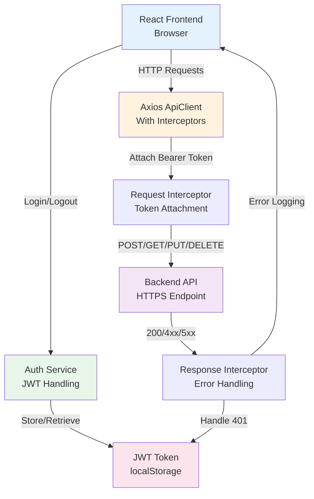

# API Communication Security

## Overview

StockEase Frontend communicates with the backend API using HTTPS with JWT-based authentication. This directory documents security practices, threat mitigation strategies, and best practices for API communication.

---

## Security Architecture



---

## Key Components

### 1. **Axios API Client** (`src/services/apiClient.ts`)
- Configured HTTP client with automatic token attachment
- Request/response logging for debugging
- 401 error handling (unauthorized token cleanup)
- 2-minute request timeout
- Bearer token automatic injection

**See:** [API Security & Configuration](./api-security.md)

### 2. **JWT Authentication** (`src/api/auth.ts`)
- User login with username/password
- JWT token extraction from response
- Role-based access control (RBAC)
- Client-side payload decoding
- Token lifecycle management

**See:** [Authentication & Token Handling](../../auth/overview.md)

### 3. **Error Handling & Logging**
- API error logging and tracking
- 401 unauthorized response handling
- Network error differentiation
- Sensitive data protection in logs
- Error propagation to ErrorBoundary

**See:** [Error Logging & Monitoring](./error-logging.md)

### 4. **Environment Configuration**
- `VITE_API_BASE_URL` for backend endpoint
- Build-time environment variable injection
- Development proxy for local testing
- Production HTTPS enforcement

---

## Security Principles

### ✅ Implemented

- **Bearer Token Authentication** — JWT tokens sent via Authorization header
- **Automatic Token Attachment** — Request interceptor adds token to all requests
- **401 Error Handling** — Clears token on unauthorized responses
- **Request Logging** — API calls logged for debugging
- **Timeout Protection** — 2-minute timeout prevents hanging requests
- **Environment Isolation** — API endpoint configured per environment

### ⚠️ Considerations

- **localStorage Storage** — Tokens in localStorage are accessible to XSS attacks
  - **Recommendation:** Use HttpOnly cookies for better security
  - **Current:** localStorage fallback for development flexibility
  
- **Client-Side Payload Decoding** — JWT payload decoded in browser
  - **Expected:** Backend must verify signature (payload is unsigned)
  - **Safe:** Payload contains no secrets (only claims like role, user ID)

- **Console Logging** — Request/response details logged to console
  - **Risk:** Sensitive headers may appear in logs
  - **Mitigation:** Filter sensitive data before logging in production

- **CORS Configuration** — Handled by backend, not frontend
  - **Frontend Role:** Sends correct headers via Axios
  - **Backend Role:** Validates origin, allows safe CORS headers

---

## API Endpoints

### Authentication

```http
POST /api/auth/login
Content-Type: application/json
Body: { username: string, password: string }
Response: { success: boolean, data: string (JWT token) }
```

### Products (All require Authorization header)

```http
GET    /api/products                    — Fetch all products
GET    /api/products/paged              — Fetch paginated products
POST   /api/products                    — Create product
DELETE /api/products/:id                — Delete product
GET    /api/products/:id                — Get product by ID
GET    /api/products/search             — Search products by name
PUT    /api/products/:id/quantity       — Update quantity
PUT    /api/products/:id/price          — Update price
```

**Headers:**
```http
Authorization: Bearer <JWT_TOKEN>
Content-Type: application/json
```

---

## Request/Response Flow

### 1. Successful Request with Token

```
Client Request
  ↓
Request Interceptor
  ├─ Retrieve token from localStorage
  ├─ Attach: Authorization: Bearer <token>
  ├─ Log request details
  └─ Send to backend
  ↓
Backend Validation
  ├─ Verify JWT signature
  ├─ Check token expiration
  ├─ Extract user claims (role, username)
  └─ Process request
  ↓
Response Interceptor
  ├─ Log response status/data
  ├─ Return data to caller
  └─ Store in component state
```

### 2. Unauthorized Response (401)

```
Backend Response: 401 Unauthorized
  ↓
Response Interceptor
  ├─ Detect error.response?.status === 401
  ├─ Remove token from localStorage
  ├─ Log warning: "Unauthorized access - redirecting to login"
  ├─ Throw error to caller
  └─ Component handles redirect to login
```

### 3. Network Error

```
Network Failure (timeout, no connection)
  ↓
Response Interceptor
  ├─ Catch error
  ├─ Log error details
  ├─ Throw to caller
  └─ Component shows "Unexpected error" message
```

---

## Environment Variables

### Development
```bash
VITE_API_BASE_URL=http://localhost:8081
```
- Used for local development with backend running locally
- Vite proxy forwards `/api/*` requests to backend

### Production
```bash
VITE_API_BASE_URL=https://api.stockease.com
```
- Set at build time via GitHub Actions secrets
- All requests use HTTPS
- CORS validated by backend

### Configuration
```typescript
// vite.config.ts
server: {
  proxy: {
    '/api': {
      target: env.VITE_API_BASE_URL || 'http://localhost:8081',
      changeOrigin: true,    // ✅ Ensures Host header matches target
      secure: false,         // ✅ Allows self-signed certs in dev
    },
  },
},
```

---

## Common Scenarios & Solutions

### ❓ Token Expired During Request

**Scenario:** User's token expires while making an API call

**Current Behavior:**
1. Request sent with valid token
2. Backend returns 401 (token expired)
3. Response interceptor removes token
4. Component re-renders, showing login screen

**Improvement Opportunity:**
- Implement token refresh mechanism with refresh tokens
- Automatically retry failed request after refresh
- Reduce user friction during long sessions

---

### ❓ CORS Errors in Browser

**Scenario:** Request from `https://frontend.com` to `https://api.stockease.com` fails

**Cause:** Browser blocks cross-origin requests without proper CORS headers

**Frontend Role:**
- Send request with correct headers ✅
- Cannot override CORS policy (browser enforces)

**Backend Responsibility:**
- Add `Access-Control-Allow-Origin` header
- Add `Access-Control-Allow-Credentials` if cookies used
- Add `Access-Control-Allow-Methods` for HTTP verbs
- Add `Access-Control-Allow-Headers` for custom headers

**Test:**
```bash
curl -i -H "Origin: https://frontend.com" \
     -H "Access-Control-Request-Method: POST" \
     -H "Access-Control-Request-Headers: Authorization" \
     https://api.stockease.com/api/products
```

---

### ❓ Sensitive Data in Logs

**Scenario:** Authorization header or response data logged to console

**Risk:** Token or user data exposed in browser dev tools

**Current Code:**
```typescript
console.log('API Request:', config);    // ⚠️ Includes full headers
console.log('API Response:', response); // ⚠️ Includes sensitive data
```

**Recommended Improvement:**
```typescript
// Filter sensitive headers before logging
const safeConfig = {
  ...config,
  headers: {
    ...config.headers,
    Authorization: '[REDACTED]', // Hide token
    Cookie: '[REDACTED]',
  },
};
console.log('API Request:', safeConfig);

// In production, remove logging entirely
if (process.env.NODE_ENV === 'development') {
  console.log('API Response:', response);
}
```

---

## Related Documentation

- **[API Security & Configuration](./api-security.md)** — Detailed axios setup, interceptors, and security settings
- **[Error Logging & Monitoring](./error-logging.md)** — Error handling, logging strategies, and troubleshooting
- **[Authentication & Authorization](../../auth/overview.md)** — JWT, token storage, role-based access
- **[Frontend Security Checklist](../../checklists/api-communication.md)** — Pre-deployment security checks
- **[Incident Response Playbook](../../playbooks/api-security-incident.md)** — Response procedures for security issues

---

## Quick Reference

| Concern | Solution | Status |
|---------|----------|--------|
| Token attached to requests | Request interceptor with Bearer token | ✅ Implemented |
| 401 handling | Remove token, redirect to login | ✅ Implemented |
| Request timeout | 2-minute timeout configured | ✅ Implemented |
| CORS support | Backend handles, frontend sends correct headers | ✅ Implemented |
| Error logging | Console logging (filter sensitive data) | ⚠️ Needs improvement |
| Token refresh | Not implemented | ⏳ Future enhancement |
| HttpOnly cookies | Not implemented (using localStorage) | ⚠️ Recommendation |
| Secure production API | HTTPS required | ✅ Enforced |

---

**Last Updated:** November 13, 2025  
**Author:** StockEase Security Team  
**Review Cycle:** Quarterly
