# Authentication & Authorization

## Overview

StockEase Frontend implements **JWT-based authentication** with **role-based access control (RBAC)**. This directory documents the complete authentication flow, user authorization system, and session management.

---

## Authentication & Authorization Architecture

```mermaid
graph TB
    User["👤 User"]
    LoginPage["📝 LoginPage"]
    AuthService["🔐 auth.ts<br/>Login API Call"]
    Backend["🖥️ Backend API<br/>Validate Credentials"]
    JWT["🔑 JWT Token<br/>+ User Role"]
    Storage["💾 localStorage<br/>token, role, username"]
    ProtectedRoute["🛡️ Protected Routes<br/>Check Role"]
    Dashboard["📊 Dashboard<br/>Admin/User"]
    
    User -->|Enter credentials| LoginPage
    LoginPage -->|username + password| AuthService
    AuthService -->|POST /api/auth/login| Backend
    Backend -->|Verify DB| Backend
    Backend -->|Return JWT| JWT
    JWT -->|Extract token + role| Storage
    Storage -->|Stored in localStorage| Storage
    LoginPage -->|Check role| ProtectedRoute
    ProtectedRoute -->|Validate role| ProtectedRoute
    ProtectedRoute -->|Navigate to| Dashboard
    
    style User fill:#e8f5e9
    style LoginPage fill:#fff3e0
    style AuthService fill:#e3f2fd
    style Backend fill:#f3e5f5
    style JWT fill:#fce4ec
    style Storage fill:#e0f2f1
    style ProtectedRoute fill:#fff9c4
    style Dashboard fill:#c8e6c9
```



---

## Key Components

### 1. **Authentication** (`src/api/auth.ts`)
User login and JWT token extraction

**See:** [Authentication Flow & Implementation](./authentication.md)

### 2. **Authorization** (`src/pages/App.tsx`, Components)
Role-based access control and route protection

**See:** [Role-Based Access Control (RBAC)](./authorization.md)

### 3. **Sessions & Tokens** (localStorage, JWT lifecycle)
Token storage, expiration, and session management

**See:** [Session & Token Management](./sessions-tokens.md)

---

## Authentication Flow (Step-by-Step)

### 1. User Submits Credentials (Login Page)

```typescript
// src/pages/LoginPage.tsx
const handleLogin = async () => {
  if (!username || !password) {
    setError('Fields are required');
    return;
  }

  try {
    const response = await login(username, password);  // Call auth service
    const { token, role } = response;

    // Persist to localStorage
    localStorage.setItem('token', token);
    localStorage.setItem('role', role);
    localStorage.setItem('username', username);

    // Redirect based on role
    navigate(role === 'ROLE_ADMIN' ? '/admin' : '/user');
  } catch (err) {
    // Handle 401, network errors, etc.
    setError('Invalid credentials');
  }
};
```

### 2. Backend Validates Credentials

```http
POST /api/auth/login HTTP/1.1
Content-Type: application/json

{
  "username": "admin",
  "password": "SecurePass123!"
}

HTTP/1.1 200 OK
Content-Type: application/json

{
  "success": true,
  "data": "eyJhbGciOiJIUzI1NiIsInR5cCI6IkpXVCJ9..."
}
```

### 3. Frontend Decodes JWT Payload

```typescript
// src/api/auth.ts
const token = response.data.data;  // JWT string
const decodedPayload = JSON.parse(atob(token.split('.')[1]));  // Decode payload
const role = decodedPayload.role;  // Extract role: ROLE_ADMIN or ROLE_USER

return { token, role };
```

**JWT Structure:**
```
eyJhbGciOiJIUzI1NiIsInR5cCI6IkpXVCJ9.   ← Header
eyJ1c2VyIjoiYWRtaW4iLCJyb2xlIjoiUk9MRV9BRE1JTiJ9.   ← Payload (decoded: {"user":"admin","role":"ROLE_ADMIN"})
SflKxwRJSMeKKF2QT4fwpMeJf36POk6yJV_adQssw5c   ← Signature (verified by backend)
```

### 4. Token Stored in localStorage

```javascript
localStorage.setItem('token', 'eyJhbGciOi...');
localStorage.setItem('role', 'ROLE_ADMIN');
localStorage.setItem('username', 'admin');
```

### 5. Request Interceptor Attaches Token

```typescript
// Every subsequent request includes Bearer token
GET /api/products HTTP/1.1
Authorization: Bearer eyJhbGciOi...

// Attached automatically by:
// src/services/apiClient.ts request interceptor
```

### 6. Route Protection & Redirect

```typescript
// src/pages/LoginPage.tsx useEffect
useEffect(() => {
  const role = localStorage.getItem('role');
  if (role) {
    // Redirect to appropriate dashboard
    navigate(role === 'ROLE_ADMIN' ? '/admin' : '/user', { replace: true });
  }
}, [navigate]);
```

---

## User Roles

### ROLE_ADMIN (Administrator)

**Permissions:**
- View admin dashboard
- Create products
- Delete products
- Edit product details
- View all inventory

**Protected Routes:**
- `/admin` — Admin dashboard
- `/add-product` — Product creation
- `/delete-product` — Product deletion
- `/product/:id/edit` — Edit products

### ROLE_USER (Regular User)

**Permissions:**
- View user dashboard
- Search products
- View product details
- View stock levels (read-only)

**Protected Routes:**
- `/user` — User dashboard
- `/search-product` — Product search
- `/list-stock` — Stock viewing
- `/product/:id/edit` — View only (no edit)

### Guest (Not Logged In)

**Permissions:**
- View home page
- View login page

**Protected Routes:**
- Cannot access any `/admin`, `/user`, `/add-product`, etc.

---

## Session Lifecycle

### Timeline of a User Session

```
TIME    EVENT                           STORAGE STATE
────────────────────────────────────────────────────────────────────
00:00   User navigates to /login       token: null, role: null
00:05   Enters credentials             token: null, role: null
00:10   Clicks "Login"                 token: null, role: null
00:15   Backend validates              token: null, role: null
00:20   JWT returned & stored          token: "eyJ...", role: "ROLE_ADMIN"
00:25   Redirected to /admin           token: "eyJ...", role: "ROLE_ADMIN"
00:30   Makes API calls with token    [Every request includes Bearer token]
05:00   User clicks "Logout" (logout button would clear storage)
05:05   localStorage cleared           token: null, role: null
05:10   Redirected to /login           token: null, role: null
05:15   Session ended                  User must login again
```

---

## Token Expiration Handling

### Current Behavior

**No automatic token refresh implemented.**

When token expires:
1. Request sent with expired token
2. Backend returns 401 Unauthorized
3. Response interceptor catches 401
4. Token cleared from localStorage
5. User sees login page

```typescript
// src/services/apiClient.ts response interceptor
if (error.response?.status === 401) {
  localStorage.removeItem('token');  // Clear token
  console.warn('Unauthorized access - redirecting to login');
}
```

**User Experience:**
```
User making API call with expired token
    ↓
Request fails with 401
    ↓
Session cleared automatically
    ↓
User redirected to login (or sees error)
    ↓
Must re-authenticate
```

### Recommended Improvement: Token Refresh

**Future Implementation (not current):**

```typescript
// Proposed: Refresh token mechanism
const refreshToken = async () => {
  try {
    const response = await apiClient.post('/api/auth/refresh', {
      refreshToken: localStorage.getItem('refreshToken'),
    });
    
    localStorage.setItem('token', response.data.token);
    // Retry original request with new token
  } catch (err) {
    // Refresh failed - logout user
    localStorage.clear();
    navigate('/login');
  }
};
```

---

## Password Security Requirements

StockEase enforces strong password validation:

```typescript
// From src/__tests__/utils/validation-rules/auth-validation.test.ts
export const validatePassword = (password: string) => {
  const errors = [];

  if (password.length < 8) {
    errors.push('Password must be at least 8 characters long');
  }
  if (!/[A-Z]/.test(password)) {
    errors.push('Password must contain at least one uppercase letter');
  }
  if (!/[a-z]/.test(password)) {
    errors.push('Password must contain at least one lowercase letter');
  }
  if (!/\d/.test(password)) {
    errors.push('Password must contain at least one digit');
  }
  if (!/[!@#$%^&*()_+=[\]{};':"\\|,.<>/?]/.test(password)) {
    errors.push('Password must contain at least one special character');
  }

  return { valid: errors.length === 0, errors };
};
```

**Requirements:**
- ✅ Minimum 8 characters
- ✅ At least 1 uppercase letter (A-Z)
- ✅ At least 1 lowercase letter (a-z)
- ✅ At least 1 digit (0-9)
- ✅ At least 1 special character (!@#$%^&*)

**Example Valid Passwords:**
- `SecurePass123!`
- `MyPassword2024#`
- `Admin@2024`

**Example Invalid Passwords:**
- `password123!` — No uppercase
- `PASSWORD123!` — No lowercase
- `Password!` — No digit
- `Password123` — No special character
- `Pass1!` — Too short (< 8 chars)

---

## Security Best Practices

### ✅ DO

- ✅ Always validate input (empty fields, password requirements)
- ✅ Store token in localStorage after login
- ✅ Attach token to all authenticated requests (via interceptor)
- ✅ Clear token on 401 error (automatic logout)
- ✅ Check user role before rendering protected components
- ✅ Implement logout button to clear session
- ✅ Use HTTPS in production (enforced)
- ✅ Validate on both client and server

### ❌ DON'T

- ❌ Store password in localStorage (never)
- ❌ Send password in subsequent requests (only for login)
- ❌ Hardcode credentials in frontend code
- ❌ Trust client-side role validation (verify on backend)
- ❌ Log tokens or sensitive data to console
- ❌ Allow requests without valid token
- ❌ Use HTTP in production (use HTTPS only)
- ❌ Skip server-side authentication validation

---

## Related Documentation

- **[Authentication Flow & Implementation](./authentication.md)** — Detailed login process and JWT handling
- **[Role-Based Access Control (RBAC)](./authorization.md)** — Route protection and permission management
- **[Session & Token Management](./sessions-tokens.md)** — Token storage, lifecycle, and expiration
- **[API Communication Security](../api-communication/overview.md)** — Bearer tokens and API security
- **[Frontend Security](../frontend/overview.md)** — XSS prevention and input validation

---

## Quick Reference

| Aspect | Implementation | Status |
|--------|-----------------|--------|
| **Login** | POST /api/auth/login with username/password | ✅ Implemented |
| **JWT Storage** | localStorage after successful login | ✅ Implemented |
| **Token Attachment** | Automatic via request interceptor | ✅ Implemented |
| **Role-Based Access** | Check role before rendering routes | ✅ Implemented |
| **401 Handling** | Clear token and redirect to login | ✅ Implemented |
| **Password Requirements** | 8+ chars, uppercase, lowercase, digit, special | ✅ Implemented |
| **Token Refresh** | Not implemented | ⏳ Future |
| **HttpOnly Cookies** | Not implemented (using localStorage) | ⚠️ Recommendation |
| **Multi-Factor Auth (MFA)** | Not implemented | ⏳ Future |
| **Session Timeout** | No automatic timeout | ⏳ Future |

---

**Last Updated:** November 13, 2025  
**Author:** StockEase Security Team  
**Status:** Enterprise-Grade Authentication System
