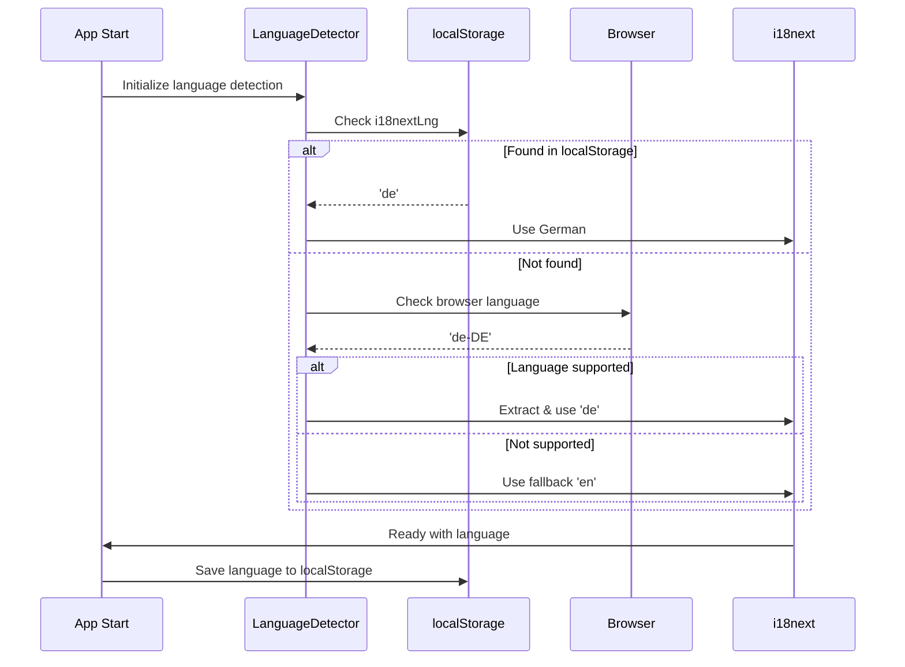

# Language Detection & Selection

## Automatic Language Detection

### Detection Priority

```
1. localStorage['i18nextLng']
   ↓ (User previously selected a language)
2. navigator.language (Browser language)
   ↓ (Browser's default language setting)
3. fallbackLng: 'en'
   ↓ (Final fallback)
English selected
```

---

## How Detection Works

### Step 1: Check localStorage

```typescript
// First boot: localStorage is empty
localStorage.getItem('i18nextLng')  // null

// After user selects German
localStorage.getItem('i18nextLng')  // 'de'
```

When i18next initializes, it checks localStorage first for a previously saved language.

### Step 2: Check Browser Language

```typescript
navigator.language  // 'de-DE'
navigator.language  // 'en-US'
navigator.language  // 'fr-FR'
```

If localStorage is empty, i18next extracts the base language code:
- 'de-DE' → 'de'
- 'en-US' → 'en'
- 'fr-FR' → falls back to 'en' (not supported)

### Step 3: Use Fallback

```typescript
// No localStorage, browser language not supported
fallbackLng: 'en'  // Default to English
```

---

## Detection Flow Diagram



---

## User Language Selection

### Manual Language Change

```typescript
import { useTranslation } from 'react-i18next';

const LanguageSwitcher = () => {
  const { i18n } = useTranslation();
  
  return (
    <div>
      <button onClick={() => i18n.changeLanguage('en')}>
        English
      </button>
      <button onClick={() => i18n.changeLanguage('de')}>
        Deutsch
      </button>
    </div>
  );
};
```

### Automatic Persistence

When user changes language:

```typescript
// User clicks German button
i18n.changeLanguage('de')

// Automatically:
// 1. Loads German translations
// 2. Saves 'de' to localStorage
// 3. Updates all components with German text
// 4. Persists across browser sessions
```

---

## Supported Languages Configuration

### Define Supported Languages

```typescript
// src/i18n.ts
.init({
  supportedLngs: ['en', 'de'],
  fallbackLng: 'en',
  // ...
})
```

### What Gets Supported?

- **en** - English
- **de** - German (Deutsch)

Users whose browser language is set to something else (e.g., 'fr', 'es') will see English.

---

## Implementation in App.tsx

```typescript
import i18n from './i18n';
import { I18nextProvider } from 'react-i18next';

function App() {
  return (
    <I18nextProvider i18n={i18n}>
      {/* App content */}
    </I18nextProvider>
  );
}
```

The `I18nextProvider` makes i18n available to all child components.

---

## Getting Current Language

### In Components

```typescript
const { i18n } = useTranslation();

// Get current language
console.log(i18n.language);  // 'en' or 'de'

// Get all available languages
console.log(i18n.languages); // ['en', 'de']

// Check if specific language is active
if (i18n.language === 'de') {
  // User is viewing German
}
```

### Example: Display Flag Based on Language

```typescript
const LanguageFlag = () => {
  const { i18n } = useTranslation();
  
  return (
    
  );
};
```

---

## Testing Language Detection

### Verify localStorage

```bash
# Open browser DevTools Console
localStorage.getItem('i18nextLng')  // 'en' or 'de'
```

### Simulate Browser Language

```javascript
// In DevTools Console
Object.defineProperty(navigator, 'language', {
  value: 'de-DE',
  configurable: true
});

// Reload page
location.reload();

// German should load (if available in translation files)
```

### Clear localStorage to Reset

```javascript
// In DevTools Console
localStorage.removeItem('i18nextLng');
location.reload();

// Will detect from browser language again
```

---

## Common Scenarios

### First-Time User (Fresh Browser)

```
1. No localStorage entry
2. Browser language: 'de-DE'
3. Extract: 'de'
4. Load German translations
5. User sees German UI
6. Save 'de' to localStorage
```

### Returning User

```
1. localStorage['i18nextLng'] = 'de'
2. Load saved language immediately
3. User sees German UI
4. Fast, no browser language check needed
```

### User Changes Browser Language

```
1. User changes OS language to French
2. App still loads German (saved in localStorage)
3. User must manually change app language
4. Or clear localStorage to re-detect
```

### User Changes App Language

```
1. User clicks German button
2. i18n.changeLanguage('de')
3. Saves to localStorage
4. Persists across sessions
5. Next login: Still German
```

---

## Edge Cases

### Unsupported Browser Language

```
Browser language: 'fr-FR' (French)
Supported: ['en', 'de']
Result: Falls back to 'en' (English)
```

### Browser Language Not Set

```
navigator.language: undefined or empty
Fallback to: 'en' (English)
```

### localStorage Disabled

```
// i18next still works, but:
// - Language resets on page reload
// - No persistence
// - Re-detects browser language each time
```

---

## Related Documentation

- [i18n Overview](./overview.md)
- [Configuration](./configuration.md)
- [Translation Files](./translation-files.md)
- [Component Patterns](./component-patterns.md)
- [Testing i18n](./testing.md)

---

**Last Updated**: November 2025

