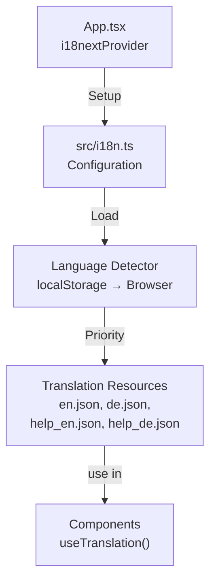

# Internationalization (i18n) & Localization

## Overview

StockEase Frontend supports **multiple languages** using **i18next**. The application provides English and German with automatic language detection and user preferences.

### Supported Languages

| Language | Code | Status |
|----------|------|--------|
| **English** | `en` | ✓ Primary |
| **Deutsch** | `de` | ✓ Supported |

---

## Quick Start

### Using Translations in Components

```typescript
import { useTranslation } from 'react-i18next';

const MyComponent = () => {
  const { t, i18n } = useTranslation();
  
  return (
    <div>
      <h1>{t('common.appName')}</h1>
      <button onClick={() => i18n.changeLanguage('de')}>
        Deutsch
      </button>
    </div>
  );
};
```

### Key Translation Patterns

```typescript
// Simple: t('key')
t('common.appName')  // → "StockEase"

// Nested: t('section.key')
t('login.title')     // → "Login"

// Interpolation: t('key', { var })
t('welcome', { name: 'John' })  // → "Welcome, John!"
```

---

## Architecture



---

## Key Components

### Configuration (`src/i18n.ts`)
- i18next initialization
- Language detection setup
- Resource loading

See [Configuration Guide](./configuration.md)

### Translation Files
- **en.json, de.json** - App UI translations
- **help_en.json, help_de.json** - Help modal content

See [Translation Files](./translation-files.md)

### Language Detection
- Checks localStorage first (user preference)
- Falls back to browser language
- Final fallback: English

See [Language Detection](./language-detection.md)

### Component Usage
- `useTranslation()` hook
- `useTranslation('namespace')` for specific namespaces
- Automatic language switching

See [Component Patterns](./component-patterns.md)

---

## Language Detection Priority

```
1. localStorage['i18nextLng'] (user's choice)
     ↓
2. navigator.language (browser language)
     ↓
3. Fallback: 'en' (English)
```

When user changes language, it persists to localStorage.

---

## File Structure

```
src/
├── i18n.ts                # i18next configuration
└── locales/
    ├── en.json           # English translations
    ├── de.json           # German translations
    ├── help_en.json      # English help content
    └── help_de.json      # German help content

docs/architecture/src/i18n/
├── overview.md           # This file
├── configuration.md      # i18n.ts setup guide
├── translation-files.md  # JSON file structure & sections
├── language-detection.md # How language is detected
├── component-patterns.md # Using i18n in components
└── testing.md           # Testing i18n functionality
```

---

## Quick Links

- ⚙️ [Configuration Guide](./configuration.md) - i18n setup
- 📄 [Translation Files](./translation-files.md) - JSON structure
- 🌍 [Language Detection](./language-detection.md) - Automatic language selection
- 💻 [Component Patterns](./component-patterns.md) - Using in React
- 🧪 [Testing i18n](./testing.md) - Test patterns

---

## Common Tasks

### Add New Translation
1. Add key to en.json
2. Add German translation to de.json
3. Use in component: `t('section.key')`

See [Translation Files](./translation-files.md) for detailed sections.

### Switch Language
```typescript
const { i18n } = useTranslation();
i18n.changeLanguage('de');  // Automatically saves to localStorage
```

### Get Current Language
```typescript
const { i18n } = useTranslation();
const current = i18n.language;  // 'en' or 'de'
```

### Test Translation
```typescript
const { t } = useTranslation();
expect(t('common.appName')).toBe('StockEase');
```

---

## Performance & Best Practices

### ✅ Do's
- ✓ Use nested keys for organization
- ✓ Keep translation files organized by feature
- ✓ Always provide default values in tests
- ✓ Use TypeScript for type safety
- ✓ Test both languages

### ❌ Don'ts
- ✗ Hardcode text in components
- ✗ Mix multiple languages in one key
- ✗ Skip translating new features
- ✗ Use auto-translation tools (use human translators)

---

## Related Documentation

- [Main Architecture Overview](../../overview.md)
- [Component Architecture](../components.md)
- [Testing Strategy](../tests.md)

---

**Last Updated**: November 2025  
**Languages**: English, German  
**Framework**: i18next  
**Status**: Production Ready

