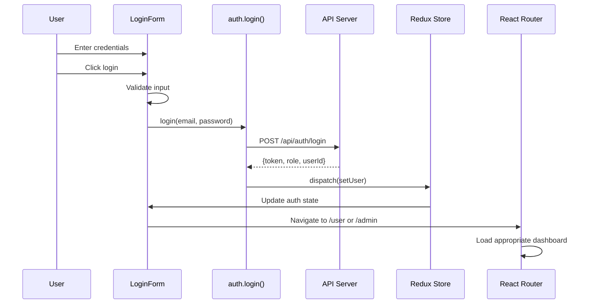
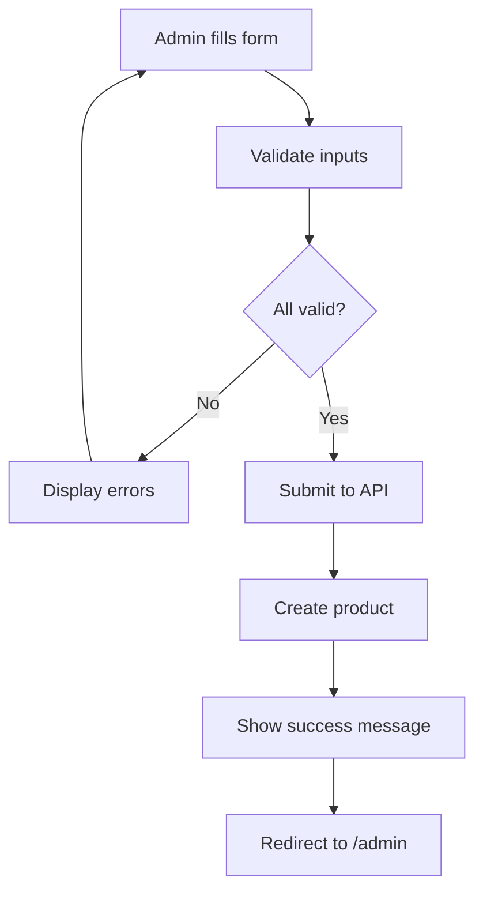
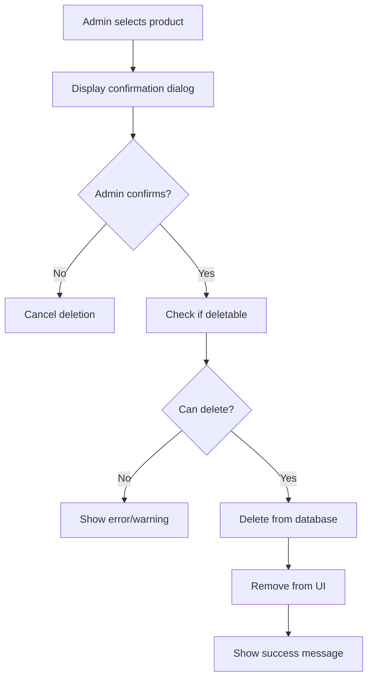

# Page Components Reference

## Complete Page Inventory

This document describes each page component in detail, including its purpose, features, and usage.

---

## 1. HomePage

**Route**: `/`

**Access**: Public (no authentication required)

**Purpose**: Landing page and application introduction

**Features**:
- Welcome message with app description
- Navigation to main features
- Quick stats or featured products (optional)
- Link to login for unauthenticated users
- Feature highlights

**Layout**:
```
┌─────────────────────────────────┐
│           Header                │
├─────────┬───────────────────────┤
│         │                       │
│ Sidebar │  Hero Section         │
│         │  - Welcome            │
│         │  - Feature highlights │
│         │  - Call to action     │
│         │                       │
├─────────┴───────────────────────┤
│           Footer                │
└─────────────────────────────────┘
```

**Key Elements**:
- Hero section with app overview
- Feature cards
- Login/Sign-up buttons
- Navigation links

---

## 2. LoginPage

**Route**: `/login`

**Access**: Public (redirects if already authenticated)

**Purpose**: User authentication and session initiation

**Features**:
- Login form (email/username, password)
- Form validation with error messages
- Loading state during submission
- Remember me option (optional)
- Redirect to dashboard on successful login

**Form Fields**:
```
Email/Username    [__________________]
Password          [__________________]
                  [☐ Remember me]

         [Cancel] [Login]
```

**Submission Flow**:



**Error Handling**:
- **Invalid credentials**: Display error message, allow retry
- **Network error**: Show retry prompt or connection error
- **Server error**: Display generic error message
- **Session expired**: Clear cache, redirect to login

**Success Handling**:
- Save auth token to localStorage
- Store user role (admin/user)
- Redirect based on role:
  - Admin → `/admin` (AdminDashboard)
  - User → `/user` (UserDashboard)

---

## 3. UserDashboard

**Route**: `/user`

**Access**: Authenticated users only

**Purpose**: User-specific inventory management and statistics

**Features**:
- Display products owned by user
- Inventory statistics (total, value, low stock)
- Search and filter functionality
- Quick product actions (view, edit, delete)
- Responsive grid/table layout
- Real-time updates

**Data Flow**:

```
Page Load
  ↓
Check authentication
  ├─ Not authenticated → Redirect to /login
  └─ Authenticated → Continue
  ↓
Fetch user's products (via Redux/API)
  ↓
Calculate statistics
  ├─ Total products count
  ├─ Total inventory value
  ├─ Low stock items count
  └─ Average price
  ↓
Render dashboard with data
```

**Key Sections**:
- **Statistics Cards**
  - Total Products
  - Total Value
  - Low Stock Count
  - Average Price
  
- **Product Table/Grid**
  - Product name, price, quantity
  - Stock status indicator
  - Last updated date
  - Action buttons

- **Filter/Search Bar**
  - Search by product name
  - Filter by stock status
  - Sort options

---

## 4. AdminDashboard

**Route**: `/admin`

**Access**: Admin users only

**Purpose**: Administrative control panel

**Features**:
- View entire product inventory (not just owned products)
- System-wide statistics
- Quick links to admin operations
- User management (optional)
- Bulk operations (optional)

**Admin-Specific Features**:
- View all products in system
- Add/edit/delete product links
- Audit logs (optional)
- System health overview
- User activity summary

**Quick Links**:
- [Add Product](./components.md#5-addproductpage)
- [Edit Product](./components.md#6-changeproductdetailspage)
- [Delete Product](./components.md#7-deleteproductpage)
- View All Products

---

## 5. AddProductPage

**Route**: `/add-product`

**Access**: Admin users only

**Purpose**: Create and add new products to inventory

**Features**:
- Product information form
- Input validation
- Error messages
- Success confirmation
- Redirect to admin dashboard after save

**Form Fields**:
```
Product Name      [__________________]
Price             [__________________]
Quantity          [__________________]
Description       [__________________]
Category (opt.)   [__________________]

         [Cancel] [Save Product]
```

**Form Validation**:
- Product name: Required, max 100 chars
- Price: Required, positive number
- Quantity: Required, non-negative integer
- Description: Optional, max 500 chars

**Submission Flow**:



**Error Handling**:
- Show field-level validation errors
- Display API error messages
- Allow retry on failure

---

## 6. ChangeProductDetailsPage

**Route**: `/product/:productId/edit`

**Access**: Admin users only

**Purpose**: Edit and update existing product information

**Features**:
- Pre-populated form with current product data
- Update validation
- Optimistic UI updates
- Conflict resolution
- Change history (optional)

**Route Parameters**:
- `productId` (number or string): ID of product to edit

**Data Flow**:

```
1. Extract productId from URL: /product/123/edit
2. Load product details from API
3. Pre-fill form with current values
4. Admin edits fields
5. Submit changes
6. Update in backend
7. Update Redux store
8. Show success message
9. Redirect to /admin
```

**Form Pre-filling**:

```typescript
useEffect(() => {
  const product = ProductService.getProduct(productId);
  setForm({
    name: product.name,
    price: product.price,
    quantity: product.quantity,
    description: product.description
  });
}, [productId]);
```

**Change Tracking** (optional):
- Show which fields changed
- Display original values
- Confirm before save

---

## 7. DeleteProductPage

**Route**: `/delete-product`

**Access**: Admin users only

**Purpose**: Safely delete products with confirmation

**Features**:
- Product search/selection dropdown
- Confirmation dialog with warning
- Safety checks (e.g., can't delete if in orders)
- Success/error feedback
- Optional undo functionality

**Deletion Flow**:



**Safety Checks**:
- Verify product exists
- Check for related orders
- Require admin confirmation
- Log deletion action

**Confirmation Dialog**:
```
Are you sure you want to delete this product?

Product: Hammer (ID: 123)
This action cannot be undone.

[Cancel] [Delete Permanently]
```

---

## 8. SearchProductPage

**Route**: `/search-product`

**Access**: Authenticated users

**Purpose**: Search and filter products across inventory

**Features**:
- Text search by product name (with debouncing)
- Filter options (category, price range, stock status)
- Result pagination
- Result count display
- Loading states
- No results handling

**Search Parameters**:
- Query: Product name (substring match)
- Category (optional): Product type
- Price range (optional): Min-Max price filter
- Stock status (optional): Low stock / In stock

**Search Flow**:

```
User types in search box
  ↓
Debounce (300ms wait)
  ↓
Call ProductService.searchProducts(query, filters)
  ↓
Show loading spinner
  ↓
Receive results from API
  ↓
Display results with pagination
  ↓
User can refine filters
  ↓
Results update automatically
```

**Results Display**:
- Product cards or table rows
- Relevant information (name, price, quantity)
- Action buttons (view, edit)
- Pagination controls

---

## 9. ListStockPage

**Route**: `/list-stock`

**Access**: Authenticated users

**Purpose**: View complete inventory with sorting and filtering

**Features**:
- Complete product inventory list
- Sorting by multiple columns
- Filtering by stock status
- Pagination
- Multiple view options (table, grid, card)
- Export functionality (optional)

**Display Options**:
- **Table View** (default): Compact, sortable columns
- **Grid View**: Card-based layout
- **Card View**: Mobile-friendly, touch-optimized

**Table Columns**:
- Product ID
- Product Name
- Price
- Quantity in Stock
- Status (Low stock / In stock)
- Last Updated
- Actions (View, Edit, Delete)

**Sorting Options**:
- By name (A→Z, Z→A)
- By price (Low→High, High→Low)
- By quantity (Low→High, High→Low)
- By last updated (Newest first)

**Filtering**:
- Stock status: Low stock / In stock / All
- Price range: Min-Max filter
- Category: Optional category filter

**Pagination**:
- Items per page: 10, 25, 50
- Page numbers
- Previous/Next buttons
- Jump to page input

---

## Navigation Between Pages

### From HomePage
- → LoginPage (if not authenticated)
- → UserDashboard (if logged in)
- → AdminDashboard (if admin)

### From LoginPage
- → UserDashboard (user role)
- → AdminDashboard (admin role)

### From UserDashboard
- → SearchProductPage
- → ListStockPage
- → AdminDashboard (if admin)

### From AdminDashboard
- → AddProductPage
- → ChangeProductDetailsPage (via product list)
- → DeleteProductPage
- → UserDashboard

---

## Related Documentation

- [Overview](./overview.md) - Routing architecture and summary
- [Page Lifecycle](./lifecycle.md) - Component structure and patterns
- [Authentication](./authentication.md) - Route protection and access control
- [Performance](./performance.md) - Lazy loading and optimization
- [Testing](./testing.md) - Testing strategies

---

**Last Updated**: November 2025

