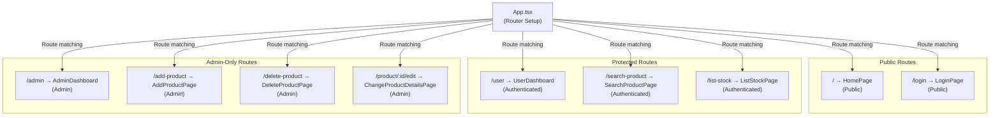

# Pages & Routing Architecture Overview

## What Are Pages?

Pages in StockEase are **route-connected components** that represent distinct sections of the application. Each page is responsible for its own data fetching, state management, and layout.

### Key Principles

- **Route-Based Organization**: Each route has a corresponding page component
- **Layout Wrapper**: Consistent header, sidebar, and footer across pages
- **Authentication Gating**: Pages check user authentication and roles
- **Lazy Loading**: Pages are code-split for faster initial load
- **Self-Contained**: Each page manages its own state and effects

---

## Routing Architecture



---

## Route Configuration in App.tsx

```typescript
<Routes>
  {/* Public */}
  <Route path="/" element={<HomePage />} />
  <Route path="/login" element={<LoginPage />} />
  
  {/* Protected - All Authenticated Users */}
  <Route path="/user" element={<UserDashboard />} />
  <Route path="/search-product" element={<SearchProductPage />} />
  <Route path="/list-stock" element={<ListStockPage />} />
  
  {/* Admin-Only */}
  <Route path="/admin" element={<AdminDashboard />} />
  <Route path="/add-product" element={<AddProductPage />} />
  <Route path="/delete-product" element={<DeleteProductPage />} />
  <Route path="/product/:productId/edit" element={<ChangeProductDetailsPage />} />
</Routes>
```

---

## Page Summary Table

| Route | Page Component | Access | Purpose |
|-------|---|---|---|
| `/` | HomePage | Public | Landing page & introduction |
| `/login` | LoginPage | Public | User authentication |
| `/user` | UserDashboard | Authenticated | User inventory view |
| `/admin` | AdminDashboard | Admin Only | Admin control panel |
| `/add-product` | AddProductPage | Admin Only | Create new product |
| `/delete-product` | DeleteProductPage | Admin Only | Delete product |
| `/product/:id/edit` | ChangeProductDetailsPage | Admin Only | Edit product details |
| `/search-product` | SearchProductPage | Authenticated | Search & filter products |
| `/list-stock` | ListStockPage | Authenticated | Complete inventory list |

---

## Page Categories

### Public Pages (No Auth Required)

- **HomePage**: Entry point, features, login link
- **LoginPage**: Authentication form

### Protected Pages (Login Required)

- **UserDashboard**: User's own inventory
- **SearchProductPage**: Search across products
- **ListStockPage**: Full inventory view

### Admin Pages (Admin Role Required)

- **AdminDashboard**: Admin controls
- **AddProductPage**: Create products
- **DeleteProductPage**: Delete products
- **ChangeProductDetailsPage**: Edit products

---

## Navigation Flow

```
User visits app
├─ Not logged in
│  ├─ Lands on HomePage
│  └─ Can navigate to LoginPage
│
├─ After login (User role)
│  ├─ Redirected to UserDashboard
│  ├─ Can access SearchProductPage
│  └─ Can access ListStockPage
│
└─ After login (Admin role)
   ├─ Redirected to AdminDashboard
   ├─ Can access all user pages
   └─ Can access admin pages (Add, Edit, Delete)
```

---

## Typical Page Structure

Every page follows a consistent pattern:

```typescript
const PageName: React.FC = () => {
  // 1. Authentication check
  // 2. State initialization
  // 3. Data fetching
  // 4. Event handlers
  // 5. Conditional rendering (loading, error)
  // 6. Layout rendering
};
```

See [Page Lifecycle](./lifecycle.md) for detailed implementation patterns.

---

## Layout Template

All pages share a consistent layout structure:

```
┌─────────────────────────────────┐
│         Header                  │
├────────────┬────────────────────┤
│            │                    │
│ Sidebar    │   Page Content     │
│            │                    │
├────────────┴────────────────────┤
│         Footer                  │
└─────────────────────────────────┘
```

Components like Header, Sidebar, and Footer are shared across all pages for consistency.

---

## Documentation Structure

This documentation is organized into focused topics:

- **[Overview](./overview.md)** (this file)
  - Routing architecture, route configuration, page summary
  
- **[Page Components](./components.md)**
  - Detailed documentation of each page (HomePage, LoginPage, UserDashboard, etc.)
  
- **[Page Lifecycle](./lifecycle.md)**
  - Page component structure, lifecycle hooks, typical patterns
  
- **[Authentication & Protection](./authentication.md)**
  - Route protection, role-based access, authentication patterns
  
- **[Performance & Optimization](./performance.md)**
  - Lazy loading, memoization, code splitting, optimization techniques
  
- **[Testing Pages](./testing.md)**
  - Testing strategies, test structure, testing patterns

---

## Quick Reference

### Access a Protected Page (Admin Only)

```typescript
<Route 
  path="/admin" 
  element={<ProtectedRoute component={AdminDashboard} requiredRole="admin" />}
/>
```

### Lazy Load a Page

```typescript
const AdminDashboard = lazy(() => import('./pages/AdminDashboard'));

<Suspense fallback={<SkeletonLoader />}>
  <AdminDashboard />
</Suspense>
```

### Check Authentication in Component

```typescript
const { user, isAuthenticated } = useSelector(state => state.auth);

if (!isAuthenticated) {
  return <Navigate to="/login" />;
}
```

---

## Common Tasks

### Add a New Page

1. Create page component in `src/pages/`
2. Add route in `App.tsx`
3. Add to navigation (Sidebar, Header)
4. Implement authentication check if protected
5. Create tests in `src/__tests__/`

### Protect a Route

```typescript
<Route 
  path="/admin" 
  element={
    <ProtectedRoute 
      component={AdminDashboard} 
      requiredRole="admin" 
    />
  }
/>
```

### Add Authentication Check in Page

```typescript
const AdminDashboard: React.FC = () => {
  const { user, isAuthenticated } = useSelector(state => state.auth);
  
  if (!isAuthenticated || user?.role !== 'admin') {
    return <Navigate to="/login" />;
  }
  
  // Page content...
};
```

---

## Related Documentation

- [Component Architecture](./components.md) - Detailed page components
- [Page Lifecycle](./lifecycle.md) - Component structure and patterns
- [Authentication](./authentication.md) - Route protection and access control
- [Performance](./performance.md) - Optimization and lazy loading
- [Testing](./testing.md) - Testing strategies
- [Main Architecture](../overview.md) - Overall app architecture

---

**Last Updated**: November 2025  
**Total Pages**: 9 main page components  
**Protected Routes**: 6  
**Public Routes**: 2

